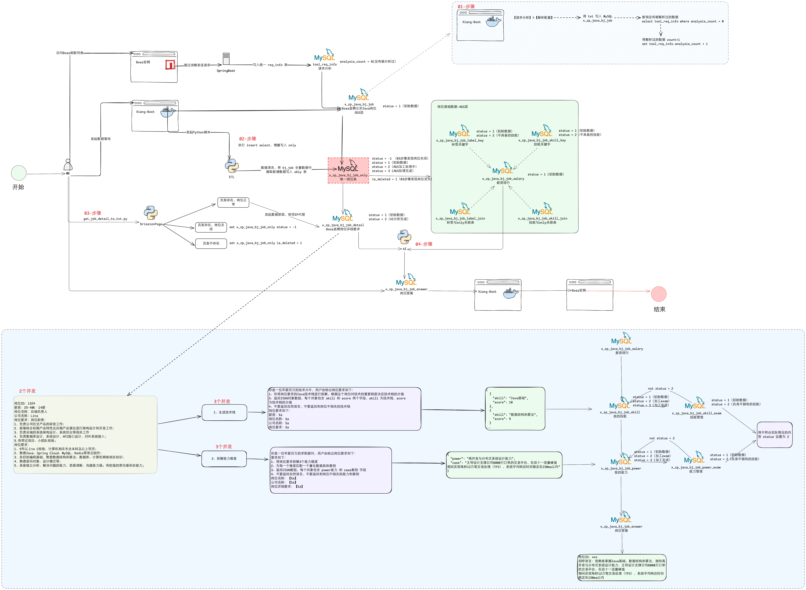

+ 6月1日
	+ 25Y-001-03（百万计划），架构图：`/OneDrive-个人/My/管理/Excalidraw/yun_analysis.excalidraw` 
	+ 流程图： 
+ 6月3日
	+ 解决 SpringBoot 流式读取 log 文件，采用 SSE 方式，可实现流式读取，不足的是，如果文件在持续写入时，客户端主动关闭连接，会出现 org.springframework.web.context.request.async.AsyncRequestTimeoutException: null 异常。临时解决方案是，将流式读取时间缩短，5秒开启，3秒内关闭文件监听，3秒内用户较少关闭客户端。i
+ 6月4日
	+ 百度网盘上传支持 Python2 的 DataX(002-开发工具/006-数据同步工具)
+ 6月9日
	+ 实现 Oracle 到 PostgreSQL 数据库同步，[001-Oracle迁移PG-ora2pg工具](../../04-数据库/09-PostgreSQL/02-Oracle迁移PG/001-Oracle迁移PG-ora2pg工具.md)

