我的资源：工具>开发工具>Linux镜像>A971

## 1、安装虚拟机

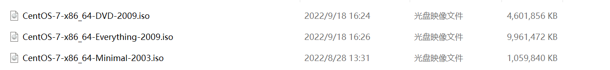

创建虚拟机

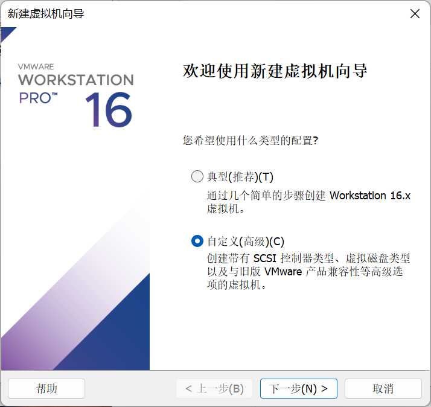

这里根据 VMware Workstation 的版本来定

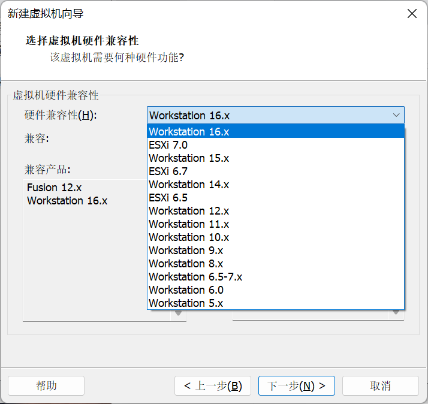

选择可用镜像，从百度网盘、其他地方下载

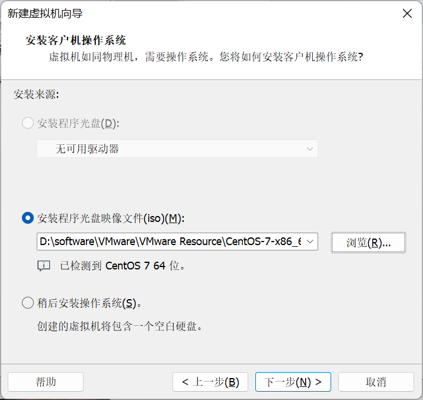

选择虚拟机的工作路径，这个路径会是这个虚拟机的所有磁盘路径

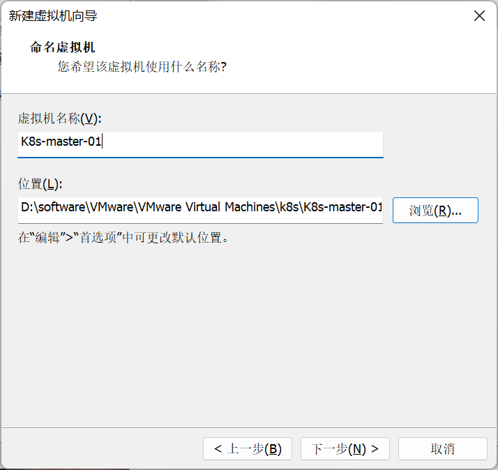

配置CPU 和 内存等，可以后期修改

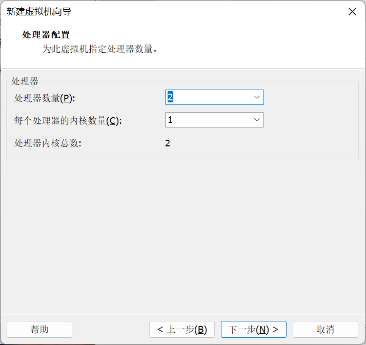

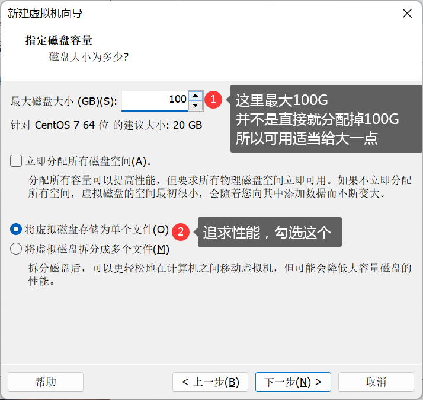

2、安装系统

因为镜像是 CentOS7 所以这里有两个选项，安装CentOS7 和 测试并安装 CentOS7，选哪个都可以

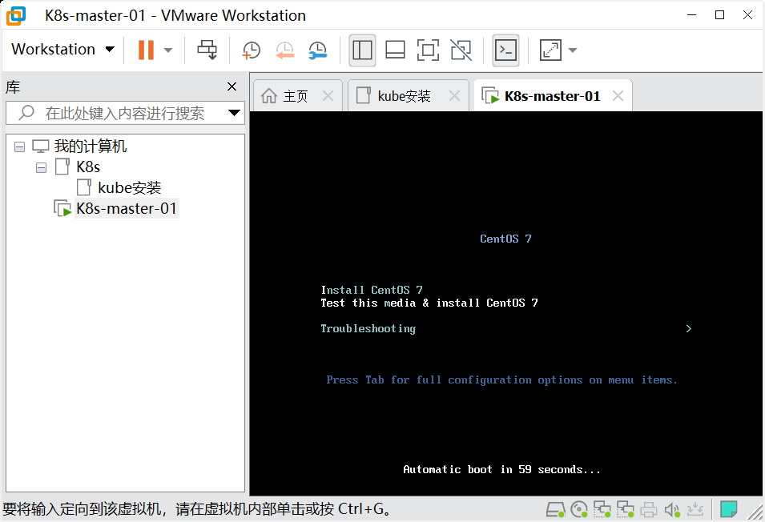
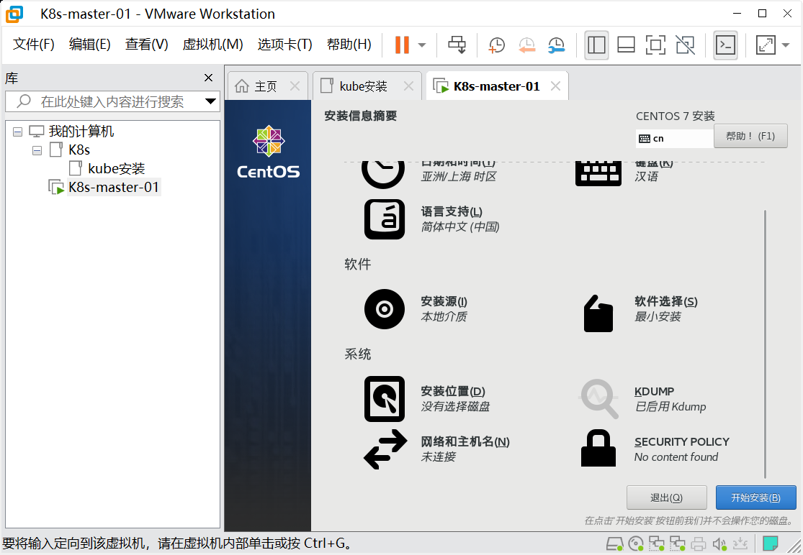

自动都配置好了，最后设置一下密码，本地虚拟机安全性就没那么强了

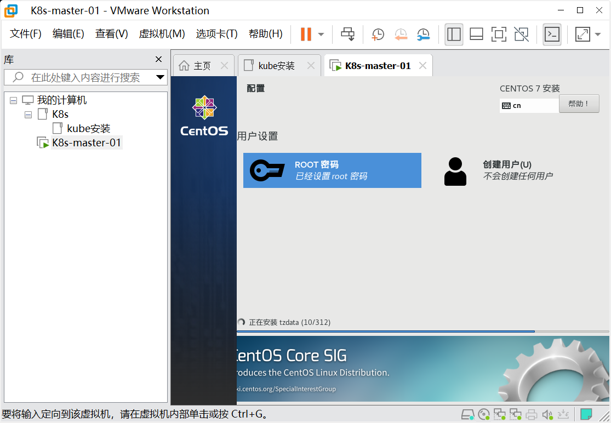

进入虚拟机

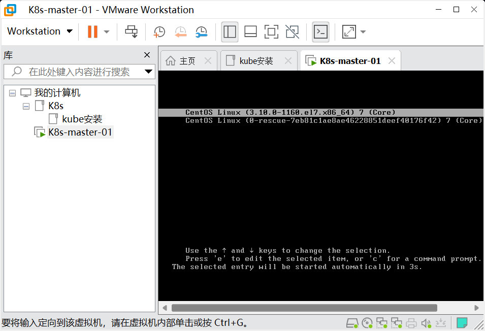

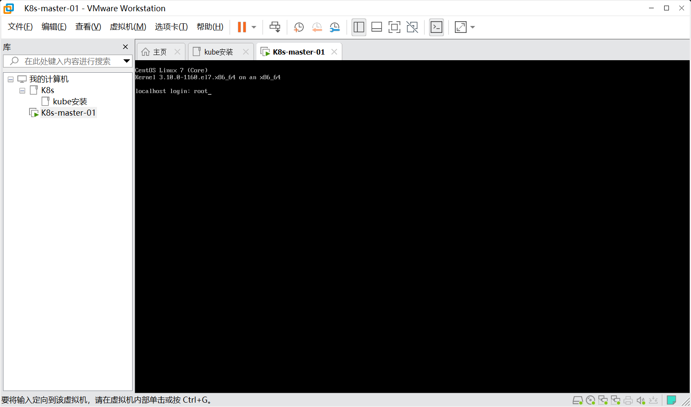


一般的服务器是没有 `ifconfig` 这个命令的，我们查不到虚拟机的IP地址，所以需要去配置一下

## 2、配置虚拟机

```sh
cd /etc/sysconfig/network-scripts
```

找到 `ifcfg-*` 开头的文件，修改配置文件中的 `ONBOOT`属性为 `yes`

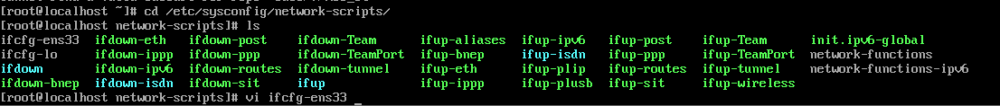

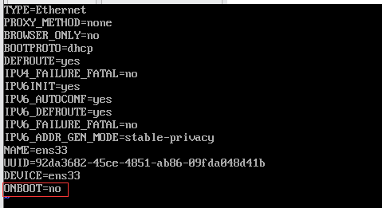

**==将 no 修改为 yes==**

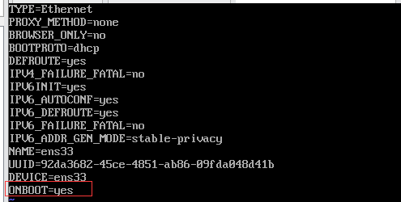

完整` ifcfg-ens33 `文件

```
TYPE=Ethernet
PROXY_METHOD=none
BROWSER_ONLY=no
BOOTPROTO=none

DEFROUTE=yes
IPV4_FAILURE_FATAL=no
IPV6INIT=yes
IPV6_AUTOCONF=yes
IPV6_DEFROUTE=yes
IPV6_FAILURE_FATAL=no
NAME=ens160
UUID=6c722ab7-d8ca-451e-a8d8-10255364fab4
DEVICE=ens160
ONBOOT=yes

IPADDR=192.168.58.10
PREFIX=24
NETMASK=255.255.255.0
GATEWAY=192.168.58.2

DNS1=119.29.29.29
DNS2=8.8.8.8
```


重启网卡

```sh
systemctl restart network

service network restart
```

这样就可以联网了，下载网络工具

```sh
yum install net-tools.x86_64 -y
```

```sh
ifconfig
```

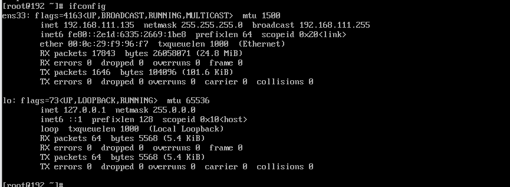

这样就知道这台服务器的IP为 `192.168.111.135`

因为用 VMware 自带的控制台太不方便了，我们还是换一个工具 XShell

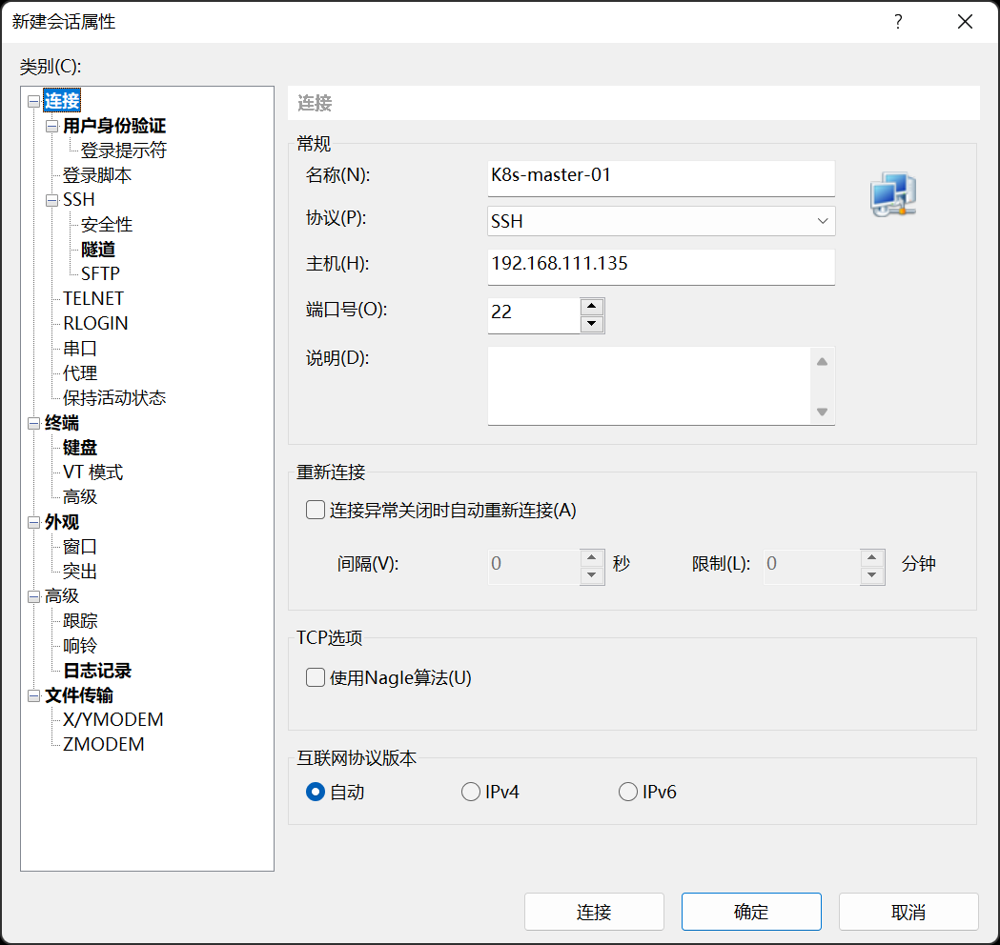

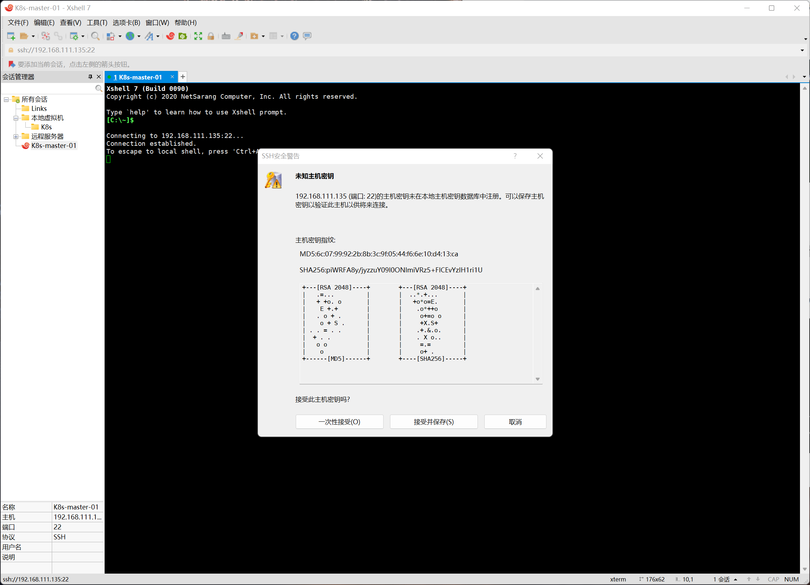

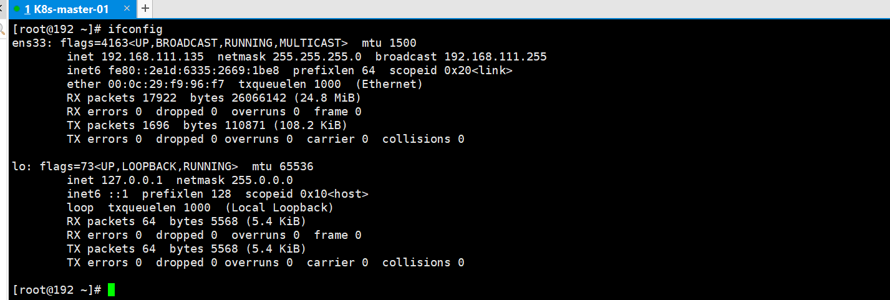

