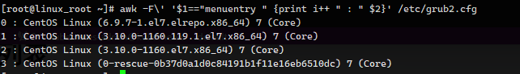

默认 CentOS7.x 内核版本是 3.10.0

英国镜像网站，一家 Coreix运营的免费服务：[https://mirrors.coreix.net](https://mirrors.coreix.net)
多版本从如下地址寻找：[http://mirrors.coreix.net/elrepo-archive-archive/kernel/el7/x86_64/RPMS/](http://mirrors.coreix.net/elrepo-archive-archive/kernel/el7/x86_64/RPMS/)

可以从百度云盘下载，或者下载全部链接

http://mirrors.coreix.net/elrepo-archive-archive/kernel/el7/x86_64/RPMS/kernel-ml-headers-6.9.7-1.el7.elrepo.x86_64.rpm
http://mirrors.coreix.net/elrepo-archive-archive/kernel/el7/x86_64/RPMS/kernel-ml-devel-6.9.7-1.el7.elrepo.x86_64.rpm
http://mirrors.coreix.net/elrepo-archive-archive/kernel/el7/x86_64/RPMS/kernel-ml-6.9.7-1.el7.elrepo.x86_64.rpm

安装

```sh
rpm -ih kernel-ml-6.9.7-1.el7.elrepo.x86_64.rpm
rpm -ih kernel-ml-devel-6.9.7-1.el7.elrepo.x86_64.rpm
```

查看安装的内核版本

```sh
awk -F\' '$1=="menuentry " {print i++ " : " $2}' /etc/grub2.cfg
```



设置为最新版本

```sh
grub2-set-default 0
```

生成 grub 配置文件

```sh
grub2-mkconfig -o /boot/grub2/grub.cfg
```

重启

```sh
reboot
```

卸载旧内核

```sh
yum remove kernel-headers
```

最后安装

```sh
rpm -ih kernel-ml-headers-6.9.7-1.el7.elrepo.x86_64.rpm
```

