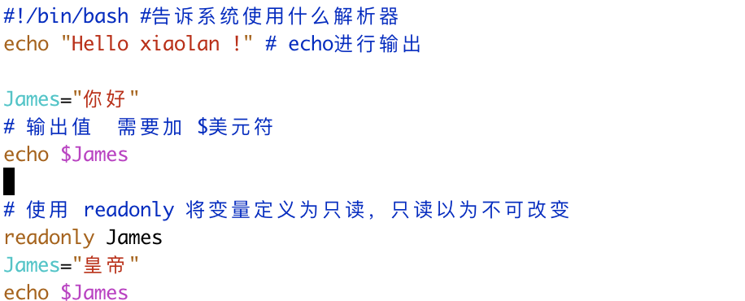
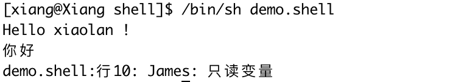
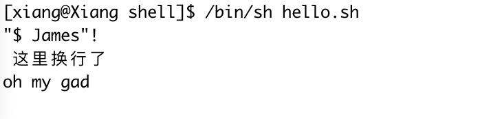
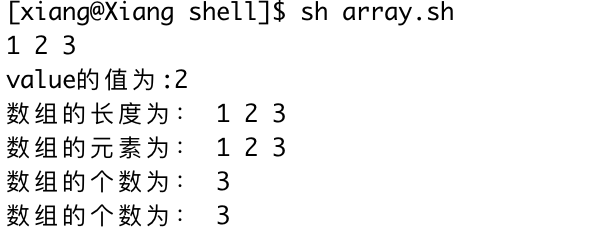
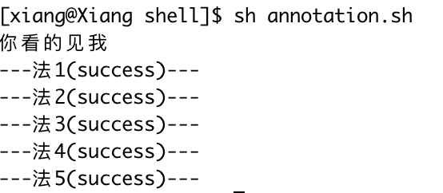
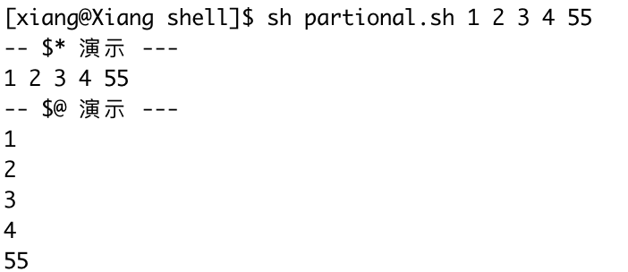
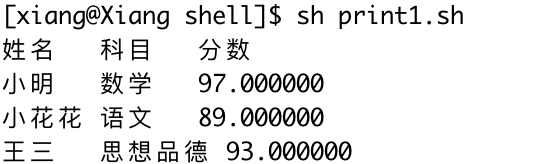
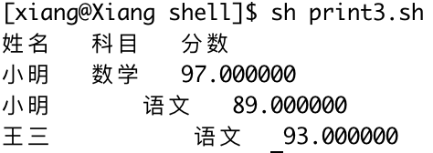

## 1、Shell 脚本

编写写一个 shell

> vim 创建打开一个文件，扩展名为.sh 

```shell
#!/bin/bash #告诉系统使用什么解析器
echo "Hello xiaolan !" # echo进行输出
```

+ 给这个文件赋予 可执行 权限

```sh
chmod +x ./hello.sh
```

+ 执行这个文件

```sh
/bin/sh hello.sh
```

### 1.1、变量

注意：变量名和等号之间不能有空格

+ 命名首个字符不能是数字，只能使用英文字母、数字和下划线
+ 不能使用标点符号
+ 不能使用bash中关键字

### 1.2、变量使用

#### 1.2.1、使用变量

（使用变量过程中，最好加上花括号）只要中变量前面加上美元符即可

```sh
James="你好"
# 输出值  需要加 $美元符
echo $James
```

#### 1.2.2、只读变量

使用 readlonly 将变量定义为只读，只读意味着不能改变



输出结果：



#### 1.2.3、删除变量

+ 局部变量：仅当前shell 可用
+ 环境变量：所有程序都能访问环境变量
+ shell变量：通过一部分环境变量和shell变量保证shell的正常运行

#### 1.2.4、字符串

使用字符串的过程中，既可以使用单引号也可用使用双引号，也可以不用

+ 单引号：单引号内容原样输出，不能包含变量，而且不能出现单个单引号
+ 双引号：==可以出现转译字符==

```sh
#!/bin/bash
mes="小皇帝"
str="\"$ James\"! \n  这里换行了\noh my gad \n "
echo -e $str
```

效果：



#### 1.2.5、获取字符串长度

使用#.    使用截取一定要用花括号

```sh
string="ABCDEFG"
echo ${#string}

# 提取子字符串
echo ${string:1:3}
#查找字符串
echo 
```

#### 1.2.6、数组

支持一维数组，数组元素使用 "逗号" 隔开

```sh
#!/bin/bash
array=( 1 2 3)
# @ 输出所有元素
echo ${array[@]}
value=${array[1]}
echo value的值为:$value
```

获取数组中所有元素及长度

```sh
echo 数组的长度为： ${array[*]}
echo 数组的元素为： ${array[@]}
echo 数组的个数为： ${#array[*]}
echo 数组的个数为： ${#array[@]}
```

Result



## 1.3、注释

#### 1.3.1、单行注释

> 使用# 开头的行为注释，会被解释器忽略

#### 1.3.2、多行注释

使用  `:`  后需要加一个 空格 ，如果不加 使用 `:'` 注释就会失效

```sh
#!/bin/bash
echo '你看的见我'

# 法1
: <<!
echo '你看不见我'
!
echo '---法1(success)---'

# 法2
: '
echo '你还是看不见我'
'
echo '---法2(success)---'

# 法3
if false;then
echo '就是不让你看见我'
fi
echo '---法3(success)---'

# 法4 这里的字符可以是任意字符
: <<字符
echo '你不可能看见我'
字符
echo '---法4(success)---'

# 法5
((0))&&{
echo '放弃吧!'
}
echo '---法5(success)---'
```

Result:



## 1.4、shell 传递参数

```sh
#!/bin/bash
James="小皇帝"
echo "执行的文件名为:$0"
echo "第一个参数为:$1"
echo "第二个参数为:$2"
```

Result


| 参数处理 | 说明                                                         |
| :------: | :----------------------------------------------------------- |
|    $#    | 传递到脚本的参数个数                                         |
|    $*    | 以一个单字符串显示所有向脚本传递的参数。<br />如 `"$*` 用  `"`  括起来的情况、以  " `$1`  `$2` .... `$n` " 的形式输出一个参数 |
|    $$    | 脚本运行到当前最后一个进程ID号                               |
|    $@    | 与 `$@` 相同，但是使用时加引号，并在引号中返回每个参数，如 `$@`  用 `"`  括起来的情况<br />以 " `$1`" "`$2`" "`$3`"  ..." `$n`" 的形式输出 |
|    $.    | 显示Shell使用的当前选项，与set命令功能相同                   |
|    $?    | 显示最后命令的退出状态，0表示没有错误，其他任何值表示错误    |


案例：

```sh
#!/bin/bash

echo "-- \$* 演示 ---"
for i in "$*"; do
    echo $i
done

echo "-- \$@ 演示 ---"
for i in "$@"; do
    echo $i
done
```

result



相同点：都是会引用所有参数

不同点：在使用双引号的时候。如果脚本运行时两个参数为a,b，则"*"等价于"ab",而"@"等价于"a","b"

## 1.5、打印

使用printf格式化字符串，同时可以指定字符串宽度和对齐方式，格式如下

```sh
#!/bin/bash
printf "%-8s %-8s %-4s\n" 姓名 科目 分数  
printf "%-8s %-8s %-4f\n" 小明 数学 97
printf "%-8s %-8s %-4f\n" 小花花 语文 89
printf "%-8s %-8s %-4f\n" 王三 思想品德 93
```

result:



```sh
#!/bin/bash
printf "%-8s %-8s %-4s\n" 姓名 科目 分数  
printf "%-8s %-8s %-4f\n" 小明 数学 97
printf "%-12s %-8s %-4f\n" 小明 语文 89
printf "%-16s %-8s %-4f\n" 王三 语文 93
```




