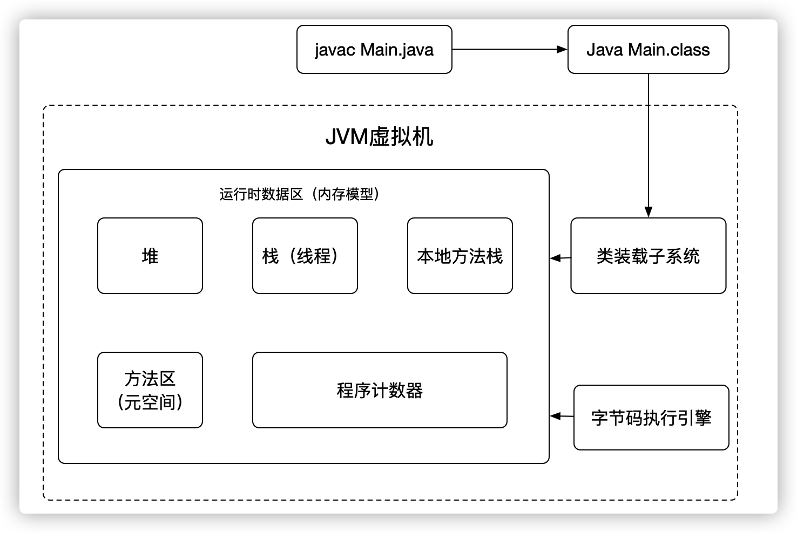
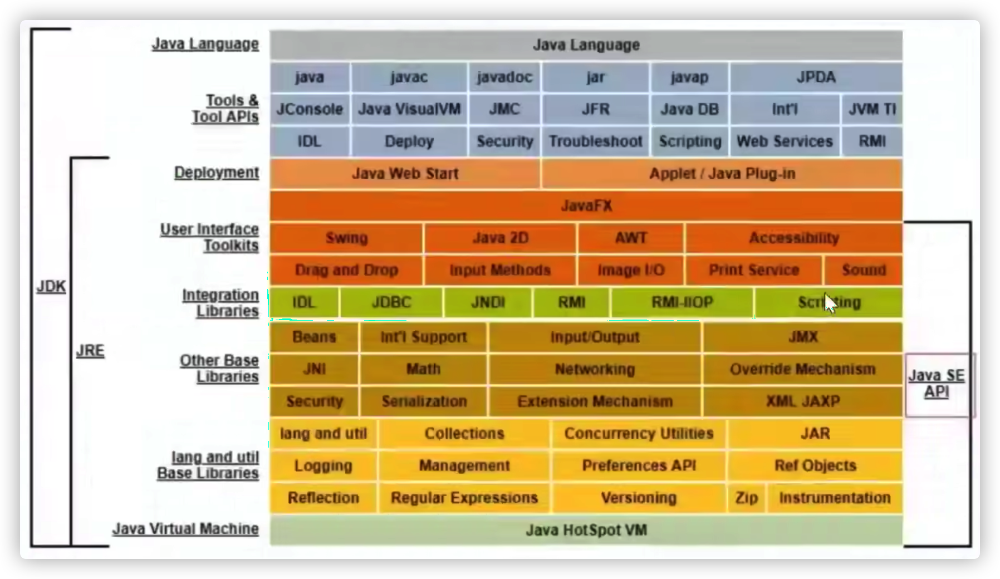
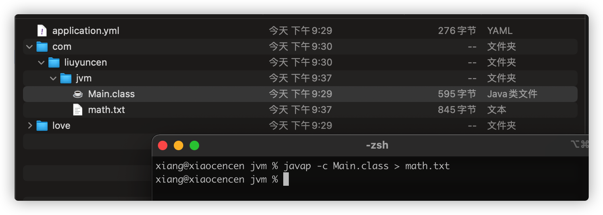
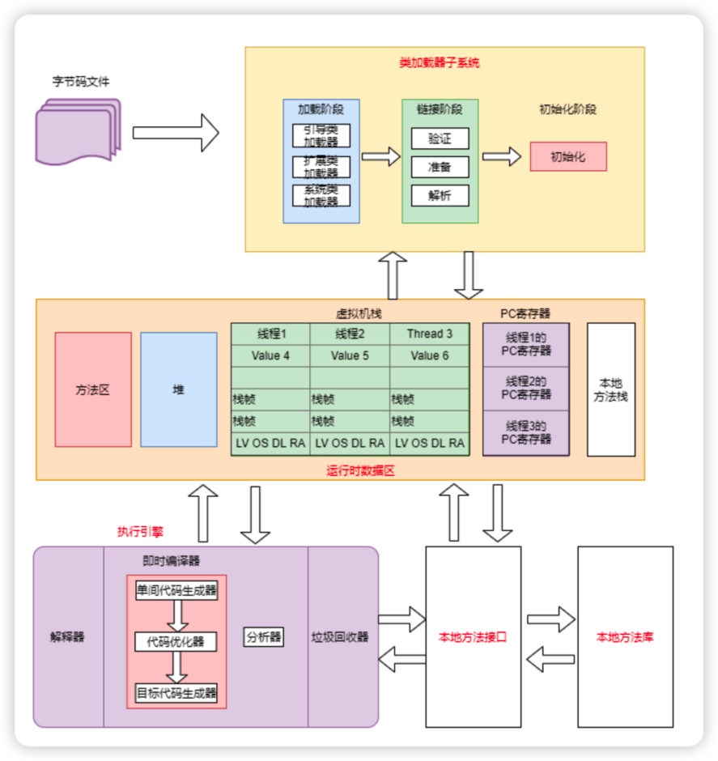

## 1、JVM由什么组成？

在图中最下面这个地方 `Java HotSpot VM` 就是我们常说的 `JVM` 虚拟机，`JVM` 由什么组成呢？



## 2、JDK 中有哪些东西？



## 3、反编译class文件

```
javac Main.java
```

就能得到一个 Main.class 文件

通过 javap 反编译 class 文件就能得到 txt 文件

```sh
javap -c Main.class > math.txt
```




```txt
Compiled from "Main.java"
public class com.liuyuncen.jvm.Main {
  public com.liuyuncen.jvm.Main();
    Code:
       0: aload_0
       1: invokespecial #1                  // Method java/lang/Object."<init>":()V
       4: return

  public static void main(java.lang.String[]);
    Code:
       0: new           #2                  // class com/liuyuncen/jvm/Main
       3: dup
       4: invokespecial #3                  // Method "<init>":()V
       7: astore_1
       8: aload_1
       9: invokevirtual #4                  // Method function:()I
      12: istore_2
      13: return

  public int function();
    Code:
       0: iconst_1
       1: istore_1
       2: iconst_2
       3: istore_2
       4: iload_1
       5: iload_2
       6: iadd
       7: bipush        10
       9: imul
      10: istore_3
      11: iload_3
      12: ireturn
}
```


 查询官方文档：[https://docs.oracle.com/javase/specs/jvms/se8/html/jvms-2.html#jvms-2.11.1](https://docs.oracle.com/javase/specs/jvms/se8/html/jvms-2.html#jvms-2.11.1)

就拿 iconst_1 而言，表示将 int 类型常量 1 压入栈中

- istore_1 将 int 类型值存入局部变量 1
- iconst_2 将 int 类型常量 2 压入栈中
- istore_2 将 int 类型值存入局部变量2


那 `_1` 和 `_2` 代表什么呢？其实就是代表类中的局部变量，你先初始化一个 a 那 a 就占用了第1个下标，再初始化了 b 那 b 就占用了第2个下标。紧接着就是 `_3` `_4`...其实还有 `_0` ，`0` 代表的 `this` 类本身

所以这就解释的通了，人们通过写 main 方法等各个函数后，再运行 main 方法，先通过 javac 编译成 class 文件，而计算机就是通过这些指令集去运行程序。

## 4、类加载机制



### 4.1、类装载子系统

过程：

1. 加载阶段：目的生成 Class 文件（ `-XX:+TraceClassLoading `查看类加载信息) 、获取 class 文件二进制流、将类信息、静态变量、字节码放到方法区
	1. 引导类加载器
	2. 扩展类加载器
	3. 系统类加载器
2. 连接阶段
	1. 验证
		1. 文件格式验证
		2. 元数据验证
		3. 字节码验证
		4. 符号引用验证
	2. 准备
		1. 给 static 修饰变量赋予初始值，比如 int 默认赋 0，成员变量会在实例后堆中赋值
		2. 比如 `public static int value = 123` 会先赋 0，再赋 123，如果是 final 修饰，直接赋予 123
	3. 解析
		1. 类、字段换成直接引用，静态块、变量初始化
3. 初始化阶段
4. 使用
5. 卸载 - GC过程

类加载器

1. 启动类加载器
	1. C/C++ 实现，嵌套在 JVM 内部
	2. 加载核心类库 JAVA_HOME/jre/lib/rt.jar
	3. 没有父加载器
2. 扩展类加载器
	1. Java 编写 sum.misc.Launcher$ExClassLoader 实现
	2. 加载 lib/ext 子类
	3. 父类是启动类加载器
3. 系统类加载器
	1. Java 编写 $AppClassLoader 实现
	2. 程序复制默认加载器，Java 应用类都是这个完成的，负责加载环境变量，或者系统变量
4. 用户自定义加载器

自定义类加载器

继承 ClassLoader 类
1. 重写 loadClass 类，这个会破坏双亲委派机制，Jdk 1.2 开始就不推荐了
2. 推荐重写 findClass 

### 4.2、双亲委派机制

+ 就是某个特定的类加载器在接到加载类的请求时，首先将加载任务委托给父类加载器，一次追溯，知道最高的爷爷辈的，如果父类加载器完成类加载任务，就返回成功；只有父类加载器完成此加载任务时，才自己去加载。
+ 双亲委托机制就是为了==保证java核心库的类型安全==。
	+ 这种机制就保证了不会出现用户自己能定义 java.lang.Object 类的情况
+ 类加载器除了用于加载类，也是安全的基本保障
	+ 双亲委托机制是代理模式的一种  if else
	+ 并不是所有类加载器都采用双亲委托机制
	+ tomcat 服务器类加载器也使用代理模式，所不同的是它是首先尝试去加载某个类，如果找不到再代理给父类加载器，这与一般加载器的顺序是相反的。