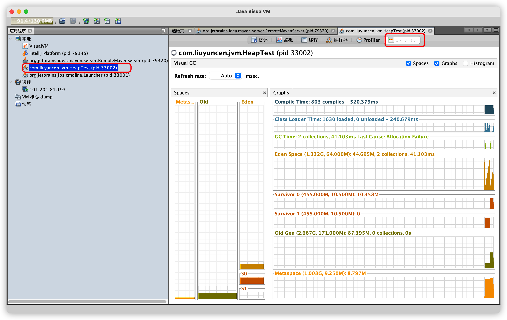
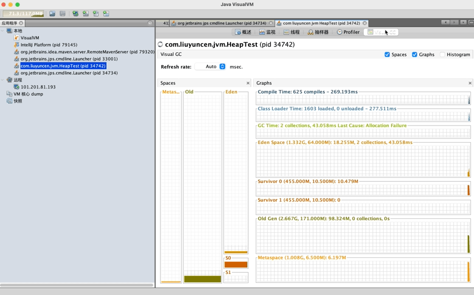
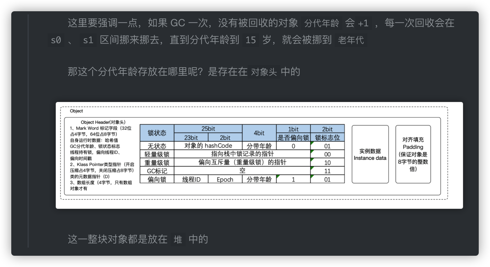
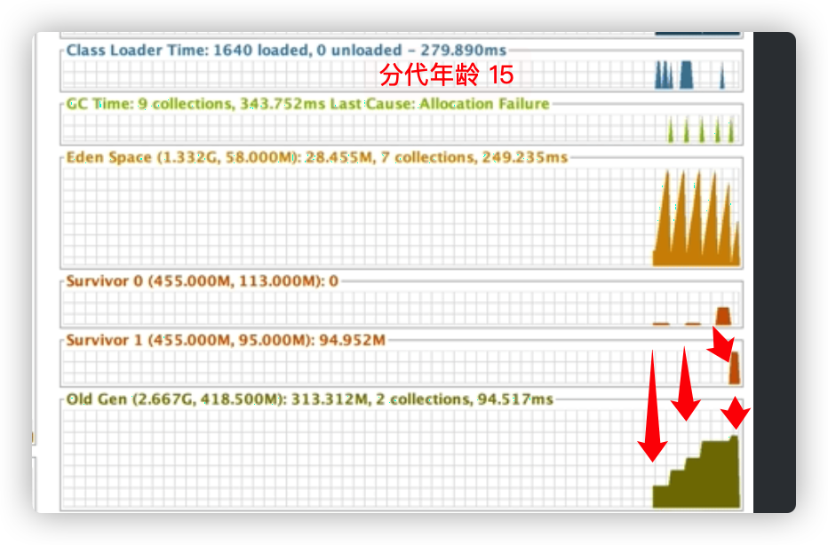
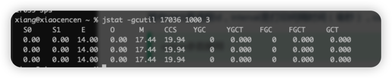

准备一段代码，更好观察 JVM 运行状态

```java
public class HeapTest {
    byte[] a = new byte[1024 * 100];
    public static void main(String[] args) throws InterruptedException {
        ArrayList<HeapTest> heapTests = new ArrayList<>();
        while (true){
            heapTests.add(new HeapTest());
            Thread.sleep(10);
        }
    }
}
```

写了一个死循环，每隔10毫秒，往list中放对象，最终这段程序肯定会内存溢出的

## 1、jvisualvm

jvisualvm 是 jdk 系统自带的 Java 诊断工具

我们先启动这段程序，然后在控制台输入 `jvisualvm` 我们可以看到这个页面



如果没有 Visual GC 这个插件的，请移步：[https://blog.csdn.net/qq_34378595/article/details/119446859](https://blog.csdn.net/qq_34378595/article/details/119446859)



通过观察，我们可以看到，Eden 区在慢慢增长，增长到一定时候，就往 S0 区挪动，后续又往 S1 区挪动，最后放入 Old 老年代。

我们再细讲图片中的内容

1. 在我们往 list 里存放对象时，Eden 区在慢慢递增，我们看 Eden Space （右侧第四行），当 Eden Space 到达顶峰时，触发一次 GC Time（右侧第三行），也就是触发了 GC
2. 触发GC也就是要回收对象了，但是我们的对象回收不了啊。我们的对象都被 list 引用了,list 被GC ROOT 局部变量引用了，所以不能回收，所以只能往 `Survior 0` 区存放
3. 当分待年龄超过15了，就往 老年代存放，没有超过15，s0 就往 s1 区挪。再触发 分代年龄15，就又往老年代挪了。可以看我近期发的文章中有说到



所以，这个图，就清晰的了解了，堆在生命周期的各个流转区。

## 2、Arthas

官网地址：https://arthas.aliyun.com/doc/commands.html

下载

```sh
wget https://alibaba.github.io/arthas/arthas-boot.jar
wget https://arthas.gitee.io/arthas-boot.jar
```

运行 

```sh
java -jar arthas-boot.jar
```

## 3、常用指令

### 3.1、jsp

```sh
jsp -l 
# 进程id、全名jar路径

-q 只显示进程id
-m 进程id、jvm启动给main的参数
-v 进程id、jvm参数
# 都可以组合使用
```

### 3.2、jinfo

```sh
-flag ${name} 打印指定名称的参数
-flag [+|-] ${name} 打开、关闭参数
-flag ${name}=${value} 设置参数
-flags 打印所有参数
-sysprops 打印系统配置
```


### 3.3、jstat

查看 JVM 运行时状态信息，内存状态、垃圾回收等

```sh
jstat [option] pid [interval] [count]
# option 参数
# pid 进程id
# interval 打印间隔时间
# count 打印次数，默认一直打印
```

案例： `jstat -gcutil 15100 1000 3 `，每隔1000毫秒打印一次，打印三次


+ S0C survivor0大小
+ S1C survivor1大小
+ S0U survivor0已使用大小
+ S1U survivor1已使用大小
+ EC Eden区大小
+ EU Eden区已使用大小
+ OC 老年代大小
+ OU 老年代已使用大小
+ MC 方法区大小
+ MU 方法区已使用大小
+ CCSC 压缩类空间大小
+ CCSU 压缩类空间已使用大小
+ YGC 年轻代垃圾回收次数
+ YGCT 年轻代垃圾回收消耗时间
+ FGC Full GC垃圾回收次数
+ FGCT Full GC垃圾回收消耗时间
+ GCT 垃圾回收消耗总时间

参数

+ -compiler HotSpt JIT编译器行为统计
+ -gc 垃圾回收堆的行为统计
+ -gccapacity 各个垃圾回收代容量(young,old,perm)和他们相应的空间统计
+ -gcutil 垃圾回收统计概述
+ -gccause 垃圾收集统计概述（同-gcutil），附加最近两次垃圾回收事件的原因
+ -gcnew 新生代行为统计
+ -gcnewcapacity 新生代与其相应的内存空间的统计
+ -gcold 年老代和永生代行为统计
+ -gcoldcapacity 年老代行为统计
+ -printcompilation HotSpot编译方法统计

### 3.4、jstack

用来查询JVM线程快照命令，定位长时间卡顿、死锁、死循环等

```sh
jstack [option] ${pid}
```

参数

+ -F 使用 jstack ${pid} 无响应时，强制输出堆栈
+ -m 同时输出 java堆栈 c/c++ 堆栈信息
+ -l 除了堆栈外，还显示锁的附加信息

cpu占用过高

+ 通过java检测工具 Process Exployer【Winodws工具】 查出Java的具体线程 10024
+ 转换成十六进制 0x2728 
+ jstack -l ${pid} 打印进程信息，找到 0x2728
+ 里面会显示相关代码

### 3.5、jmap

生成java程序dump文件，查看堆内对象统计信息

```sh
jmap [option] ${pid} 
```

参数

+ -heap 打印 heap 摘要
+ -histo:live $pid 打印堆对象占内存大小
+ -clstats $pid 打印类加载统计信息
+ -finalzerinfo 打印在 f-queue 中待执行的 finalier方法对象
+ -dump:[option] 生成java堆的dump文件
	+ live  只转储存活对象，如果没有指定转储所有
	+ format=b 二进制格式
	+ file= 转储文件到

案例：`- jmpa -dump:live,format=b,file=/Users/xiang/Desktop/dump.bin 34879`
`jmap -dump:live,format=b,file=/data/dump.bin 15100`


### 3.6、jhat

分析 jmap 生成的 dump 文件、jhat 内置服务器，通过web查看dump文件

参数

+ -stack false 关闭对象分配调用堆栈跟踪
+ -refs false 关闭对象引用跟踪
+ -port 7000 服务端口，默认7000
+ -debug 级别是 debug
+ -version 分析报告版本

案例：`- jhat -port 8960 dump.bin` ，使用 OQL 查询长度


## 4、GC日志分析

常用参数

+ -XX:+PrintGC 打印简单GC日志，类似于 -verbose:gc
+ -XX:+PrintGCDetails 打印详细GC日志
+ -XX:+PrintGCTimeStamps 输出的GC带时间戳（以基准时间形式）
+ -XX:+PrintGCDateStamps 输出GC带时间戳 日期形式
+ -XX:+PrintHeapAtGC 在GC前后打印堆日志
+ -Xloggc:../logs/gc.log 输出到指定文件

概要：

```
-Xms28m
-Xmx28m 
//开启记录GC日志详细信息（包括GC类型、各个操作使用的时间）
//,并且在程序运行结束打印出JVM的内存占用情况
-XX:+PrintGCDetails
-XX:+PrintGCDateStamps
-XX:+UseGCLogFileRotation 开启滚动生成日志
-Xloggc:E:/logs/gc.log
```

收集器参数

+ UseSerialGC  jvm在client模式下默认，开启后 Serial+Serial Old模式 
+ UseParNewGC  使用ParNew + Serial Old 组合使用
+ UserConcMarkSweepGC 使用 ParNew+CMS+Serial Old 组合，当CMS失败后使用Serial Old备用
+ UseParallelOldGC 使用Parallel Scavenge + Paralled Old 组合
+ UseParallelGC 使用 Parallel Scavenge + Serial old 组合
+ SurvivorRatio  新生代Eden和任何一个 Survivor 比例默认为8
+ PretenureSizeThreshold 直接晋升到老年代对象大小 单位byte
+ UseAdaptiveSizePolicy 动态调整Java堆中大小进入老年代的年龄，默认15
+ ParallelGCThreads 设置冰箱GC时回收线程数
+ GCTimeRatio GC时间占比比例，默认99，只在 Parallel Scavenge 收集器时生效
+ MaxGCPauseMillis 设置GC最大停留时间，只在 Parallel Scavenge 收集器时生效
+ CMSInitiatingOccupancyFraction 设置CMS收集器在老年代使用多少时出发GC，默认68%，在CMS时生效
+ CMSFullGCsBeforeCompaction 设置CMS多少次GC后进行一次内存碎片整理
+ UseG1GC 使用 G1
+ MaxGCPauseMillis 设置GC最大停留时间，JVM会尽量保证
+ G1HeapRegionSize G1将堆分成大小统一的区，这个设置每个区大小，1Mb<Size<32Mb。

GC 日志分析

```
[GC (Allocation Failure) [PSYoungGen: 12734K->2018K(14848K)] 12734K->11455K(49152K), 0.0042544 secs] [Times: user=0.01 sys=0.03, real=0.00 secs]

[a(b)[c:d->e(f), g secs] h->i(j), k secs] [Times: user:l sys=m, real=n secs]
```

+ a: GC 或者是 Full GC
+ b: 用来说明发生这次 GC 的原因 
+ c: 表示发生GC的区域，这里表示是新生代发生了GC，上面那个例子是因为在新生代中内存不够给新对象分配了，然后触发了 GC 
+ d: GC 之前该区域已使用的容量
+ e: GC 之后该区域已使用的容量
+ f: 该内存区域的总容量 
+ g: 表示该区域这次 GC 使用的时间
+ h: 表示 GC 前整个堆的已使用容量 
+ i: 表示 GC 后整个堆的已使用容量 
+ j: 表示 Java 堆的总容量 
+ k: 表示 Java堆 这次 GC 使用的时间
+ l: 代表用户态消耗的 CPU 时间 
+ m: 代表内核态消耗的 CPU 时间 
+ n: 整个 GC 事件从开始到结束的墙钟时间（Wall Clock Time）