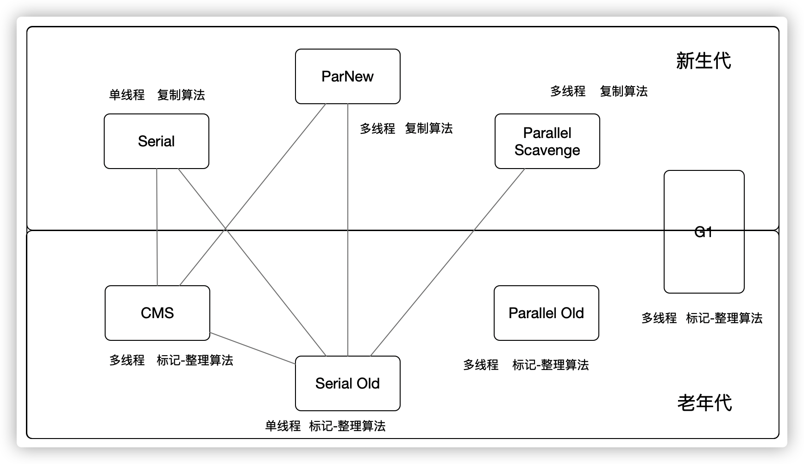
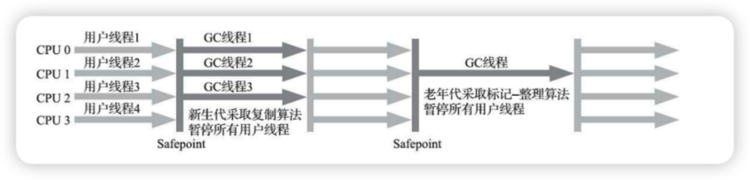
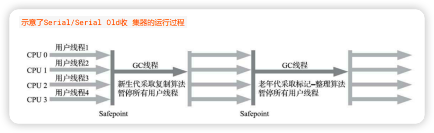
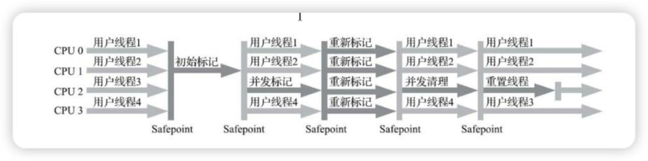
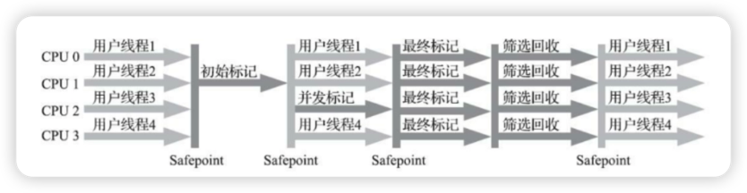

[toc]

## 1、垃圾回收过程是怎样的？

1. JVM 内存的**程序计数器、虚拟机栈、本地方法栈**的生命周期和线程是同步的，随着线程销毁而自动释放
2. 只有堆和方法区需要 GC，堆内分为新生代、老年代，新生代又分为 Eden区、Surviror 区，比例是 8：1：1
3. 对象分配再 Eden 和 S1、S2，一开始 S2 是空的，当 Eden 没有足够内存配时， 触发 Minor GC
4. 此时 Eden 、S1 将垃圾删除，非垃圾放在 S2，新对象继续分配给 Eden，又满了，触发 Minor GC
5. 此时 Eden、S2 将垃圾删除，非垃圾放在 S1，新对象继续分配给 Eden，周而复始，直到对象到达最大分代年龄，进入老年代
6. 如果老年代也不足了，就会触发 Full GC，如果再不够，系统将抛出 OOM 异常，程序终止。

## 2、如何对象是否存活？

1. 引用计数器，每次引用 +1、引用失效 -1，到 0 时，对象就不会被引用
2. 可达性分析：每次 GC 以 Root 为根，向下搜索，所到之处皆被引用，没有被搜到的，此时对象不可用

四种引用类型
1. 强引用：GC不会回收
```java
Object strongReference = new Object();  // 强引用
System.gc();  // 请求垃圾回收
// 由于strongReference是强引用，它不会被垃圾回收器回收
System.out.println("对象仍然存在");
```
2. 软引用：回不回收看内存紧张不紧张
```java
Object object = new Object();  // 强引用
SoftReference<Object> softReference = new SoftReference<>(object);
System.out.println("软引用之前：" + softReference.get());
// 删除强引用，softReference 仍然指向对象
object = null;
System.gc();  // 请求垃圾回收
// 软引用指向的对象可能会被回收，也可能不会
System.out.println("软引用之后：" + softReference.get());
```
1. 弱引用：下一次被清理掉
```java
Object object = new Object();  // 强引用
WeakReference<Object> weakReference = new WeakReference<>(object);
System.out.println("弱引用之前：" + weakReference.get());
// 删除强引用，weakReference 仍然指向对象
object = null;
System.gc();  // 请求垃圾回收
// 由于弱引用指向的对象会在下次GC时被回收，所以这里返回 null
System.out.println("弱引用之后：" + weakReference.get());
```
3. 虚引用：任何时候都会被干掉
```java
Object object = new Object();  // 强引用
ReferenceQueue<Object> referenceQueue = new ReferenceQueue<>();
PhantomReference<Object> phantomReference = new PhantomReference<>(object, referenceQueue);
// 删除强引用，phantomReference 仍然指向对象
object = null;
System.gc();  // 请求垃圾回收
// 在回收时，虚引用的对象会被加入到 referenceQueue 中
if (phantomReference.isEnqueued()) {
System.out.println("对象被加入到引用队列");
} else {
System.out.println("对象未加入引用队列");
}
```

## 3、垃圾收集算法有哪些？

1. 标记清除：标记出所有需要回收的对象，全部标记完后，把标记的全部干掉，就会产生空位，缺点就是有很多不连续的空位。
2. 标记整理：标记需要回收的对象，把存活的赶到一边，然后清理边界外的内存，如果存活对象很多，挪的过程会很费资源。
3. 复制算法：将内存分成两等份，其中一个满了，把存活的复制到另一份，下次就使用另一份。内存利用率少50%
4. 分代收集：根据年龄代特点，新生代 Eden 区就杀掉，活够 15岁的，复制算法挪到老年代，等待 Full GC。

## 4、对象内存分配策略

1. 所有对象优先放到 Eden 区，防止频繁 Full GC
2. 大对象直接进入老年代。
3. 长期存活对象进入老年代，Minor GC 15次没有干掉，就进入老年代。对象 Head 头记录分代年龄，还有锁标记。
4. 动态年龄判断，对象占 S 区一半以上，就直接进入老年代
5. 空间分配担保，这样理解，提前预判存放位置能否足够 Minor GC，如果不够，直接 Full GC

## 5、垃圾收集器有哪些？


JDK8 默认使用 Parallel Scavenge、ParallelOld
JDK 9默认使用 G1
JDK 14 弃用来 Parallel Scavenge、ParallelOld 并移除了 CMS


主要分为两个流派，新生代派和老年代派



### 5.1、Serial

新生代收集器，单线程，复制算法，回收时，STW，暂停所有线程，对于单CPU，妥妥 Top1

### 5.2、ParNew

多线程版本的 Serial，对比 Serial 多核 ParNew 厉害，单线程依旧还是 Serial 厉害，可以通过 `-XX:ParallelGCThread`  来限制收集器核心数


### 5.3、Parallel Scavenge

他比较特例，别人都是快点 GC 完，好早点结束 STW，他的目的是达到可控吞吐量，吞吐量 = 程序运行时间 / (运行时间 + 收集时间) ，高吞吐量可以有效利用 CPU 时间

+ `-XX:MaxGCPauseMills`  控制最大垃圾收集停顿时间，单位毫秒
+ `-XX:GCTimeRatio` 直接设置吞吐量，默认 99 ，意思是系统运行 100 分钟，99 分钟在工作，1分钟停止工作在收集
+ `-XX:PallGCThreads` 年轻代线程数,当Cpu小于8时，默认cpu相同，超过8 设置为 3+(5 * CPU_COUNT)/8
+ `-XX:+UseAdaptiveSizePolicy` 虚拟机自动调整比例

### 5.4、Serial Old

Serial 的老年代版本，主要以 CMS 后备方案




### 5.5、Parallel Old

Parallel Scavenge 另类老年代版本，JDK 1.6 之后才能保证整体吞吐量，如果对系统吞吐量有较高要求，可以考虑 Parallel Scavenge 和 Parallel Old 一起用。

### 5.6、CMS

Concurrent Mark Sweep，真正意义上的垃圾收集器，为短时回收不惜暂停为目的收集器，收集4个过程，两次给被人按暂停

1. 初识标记，暂停所有用户线程，可达性分析找出目标
2. 并发标记，判断对象是否存活
3. 重新标记，又一次停掉别人线程，开始标记垃圾
4. 并发清理，干掉！

CMS 收集器虽说实现了并发收集以及停顿，但是 CMS 不够完美，缺点如下：

1. 对资源敏感，会占用 CPU 资源
2. 垃圾源源不断，在标记过程中，浮动垃圾，只能等待下一次 GC
3. CMS 基于标记清理，这样就会有大量碎片


### 5.7、G1（附带参数）

JDK1.7 新生儿，相比较 CMS ，不会有碎片，可以在不牺牲吞吐量前提下精准控制停顿时间，实现低停顿垃圾回收

G1收集器不采用传统新生代、老生代物理隔离的方式，仅在逻辑上区分新生代和老年代，将整个堆内存划分为 2048 个大小相同的独立内存模块 `Region`，每个 `Region`是逻辑连续 一段内存，具体大小孔子啊在 1-32M 之间，且为2 的次幂（1、2、4、8、16、32）G1不再要求相同类型Region在物理内存相邻，只要`region` 动态的分配逻辑连续就ok

`G1`通过跟踪 Region中垃圾堆积情况，每次设置垃圾回收时间，优先回收优先级高的地方，避免整个新生代或整个老年代回收。这样 `STW`更短、更可控。


+ `-XX:MaxGCPauseMillis=200` - 设置期望达到的最大GC停顿时间指标（JVM会尽力实现，但不保证达到）
+ `-XX:InitiatingHeapOccupancyPercent=45` - mixed gc中也有一个阈值参数 ，当老年代大小占整个堆大小百分比达到该阈值时，会触发一次mixed gc. 默认值为 45.
+ `-XX:NewRatio=n` - 新生代与老生代(new/old generation)的大小比例(Ratio). 默认值为2
+ `-XX:SurvivorRatio=n` - eden/survivor 空间大小的比例(Ratio). 默认为 8
+ `-XX:MaxTenuringThreshold=n` - 提升年老代的最大临界值(tenuring threshold). 默认值为 15
+ `-XX:ParallelGCThreads=n` - 设置垃圾收集器在并行阶段使用的线程数,默认值随JVM运行的平台不同而不同.
+ `-XX:ConcGCThreads=n` - 设置垃圾收集器在并行阶段使用的线程数,默认值随JVM运行的平台不同而不同.
+ `-XX:G1ReservePercent=n` - 设置堆内存保留为假天花板的总量,以降低提升失败的可能性. 默认值是 10%
+ `-XX:G1HeapRegionSize=n` - 使用G1时Java堆会被分为大小统一的的区(region)。此参数可以指定每个heap区的大小. 默认值将根据 heap size 算出最优解. 最小值为 1Mb, 最大值为 32Mb


## 6、如何选择垃圾收集器

这么多垃圾收集器怎么选呢

+  如果你的堆大小不是很大，比如 100M，选择串行收集器效率最高 Serial

```
-XX:UseSerialGC
```

+  如果你的应用运行在单核机器，或者你的虚拟机只有单核，还是串行牛
```
-XX:+UseSerialGC
```

+ 如果你的应用是“吞吐量”优先的，并且对较长时间的停顿没有特别要求

```
-XX:+UseParallelGC
```

+ 如果你 的应用响应时间要求较高，要较少的暂停，甚至1秒就会引起大量失败，那选择 G1、ZGC、CMS 都合理，虽然他们通常比较短，但是他需要一些额外的资源去处理这些工作，吞吐量会低一点

```
-XX:+UseG1GC
```
