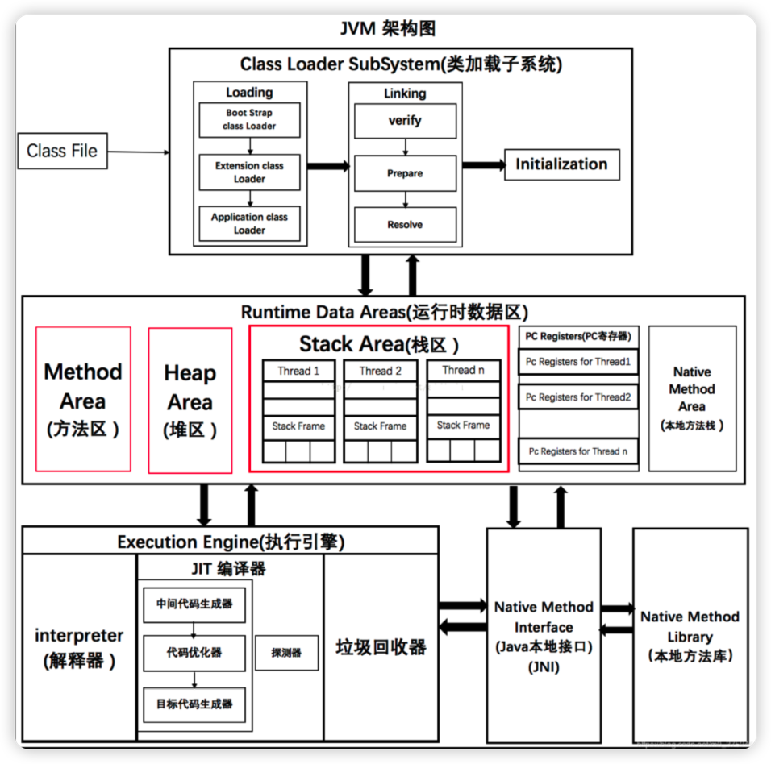
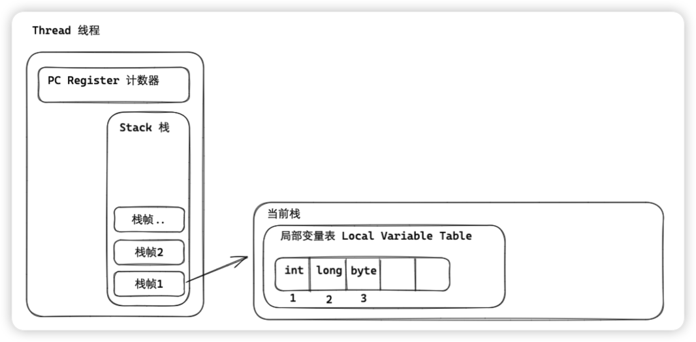
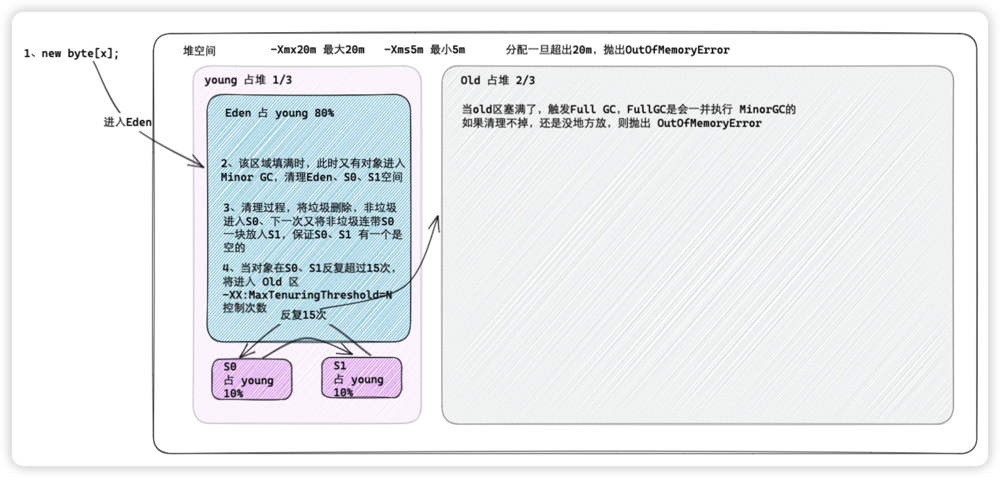
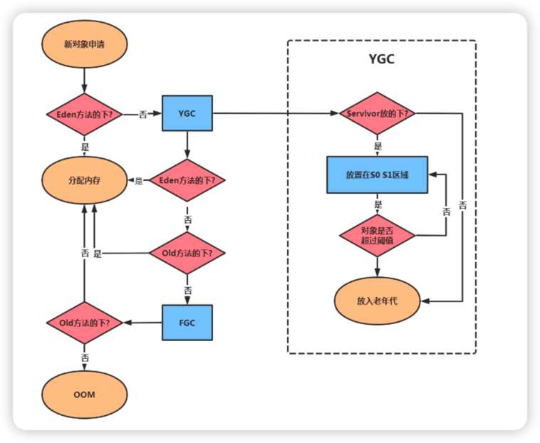

[toc]

## 1、JVM 架构图

## 2、运行时内存

### 2.1、PC 程序计数器

1. 计算机硬件 PC 寄存器，用于存放 “伪指令” 或地址，虚拟机的 PC 寄存器表现为一块内存，也存放伪指令，确切的是执行指令地址
2. 本地方法 Native ，在 PC 寄存器中存储的值是 undefined
3. 计数器是线程私有的，没一个线程一个
4. PC寄存器没有 OutOfMemoryError 这一概念

### 2.2、虚拟栈

1. 线程私有，和线程同时创建用于存储栈帧，每个方法都会创建一个栈帧（递归导致栈溢出）
2. 直观发现，IDEA debug 调试的时，进入一个方法，就会压入一个栈帧
3. 栈帧
	1. 局部变量表
	2. 操作栈帧数
	3. 动态链接
	4. 方法出口
4. 设置虚拟栈大小
	1. `-Xss`  为JVM启动每个线程分配内存大小，JDK 1.4是 256K，JDK1.5是 1M
	2. Linux、MacOS、Oracle Solaris 都是 1M
	3. `-Xss1m`、`-Xss1024k`、`-Xss1048576`
5. 栈溢出为 StackOverflowError

### 2.3、本地方法栈

1. Native 本地方法栈与虚拟栈发挥作用相似
2. 为了填补 Java 代码不方便实现的缺陷提出的
3. 虚拟机栈为虚拟机执行Java，本地方法栈为虚拟机使用了 Native 方法
4. 线程私有，生命周期与线程相同，每个线程一个
5. 两种类型异常
	1. `StackOverFlowError` 栈深度超长
	2. `OutOfMemeoryError` 扩展栈无法申请到内存

### 2.4、堆

特点：
1. Java 虚拟机所管理内存中最大一块
2. 堆上JVM所有线程共享
3. 在虚拟机启动的时候创建
4. 唯一目的就是存放对象实例，几乎所有对象以及数组都要从这里分配内存
5. Java堆是垃圾管理的主要区域
6. GC 分为 young、old，young又分为 S0、S1
7. Java 堆物理存储是不连续的，逻辑上说是连续的，通过 `-Xms`、`-Xmx`
8. 方法结束后，堆中对象不会立马移出来，仅回收时移出
9. 堆没内存了，申请扩展内存，异常抛出 `OutOfMemoryError` 异常

打印 GC 日志：`-XX:+PrintGCDetails`
分类：
1. 老年代、永久代
2. 年轻代
	1. S0、From： 占 1/10
	2. S1、To：占 1/10
	3. Eden：占 8/10

默认新生代 ： 老年代 = 1 ：2， `-XX:NewRatio=2`
调整新生代 ： 老年代 = 1 ：4，`-XX:NewRatio=4`
调整 Eden 和 S 区 占比，默认 1:1:8  ， `-XX:SurvivorRatio=8`

分配过程如下

GC分为部分收集、整体收集

+ 部分收集：
	+ Minor GC 只收集新生代，Eden、S0、S1 区，只有 Eden 满了才会触发，发生会暂停所有用户线程 STW
	+ Major GC 只收集老年代，CMS GC 单独回收老年代
		+ 先尝试 Minor GC，如果不足，再 Major GC，Major GC 比 Minor GC 满10倍
	+ Mixed GC 混合收集，G1 GC 混合回收，region 区域
+ 整堆收集
	+ Full GC 统统拿下，老年代 、 方法区不足时 会触发 Full GC

### 2.5、元数据区

#### 2.5.1、为什么废除永久代、引入元空间

永久代大小不容易确定，不好管理，HotSpot 和 JRockit 合作，JRockit 没有永久代一说，永久代 GC 复制且回收效率低

#### 2.5.2、废除永久代好处

1. 元数据分配到本地内存，元空间是最大可分配内存，就是系统可用内存，不会遇到永久代不够用的情况
2. 常量池从 PermGen 分离出来，方便 GC 管理

#### 2.5.3、调整元数据区

`-XX:MetaspaceSize` 初始化大小

`-XX:MaxMetapaceSize` 默认没有限制，可能导致无限扩张导致机器内存不足

`-XX:MinMetaspaceFreeRatio` 在GC之后，最小元空间剩余容量百分比，减少分配时垃圾过多

`-XX:MaxMetaspaceFreeRatio`  在GC之后，最大元空间剩余容量百分比，减少释放垃圾过少

### 2.6、方法区

概念：元空间、永久代是方法区具体的落地实现，主要存储加载的类信息

特点：
1. 方法区与堆一样各个线程共享内存
2. 和堆一样物理空间，不连续
3. 大小和堆一样，也可以固定大小
4. 方法区大小决定系统保持多少类，类太多也会 OOM
5. 关闭 JVM 释放方法区内存

结构：

1. 类信息：
	1. 类型信息：Class、interface、enum，修饰符 public、abstract、final
	2. 域信息，类属性、成员变量、修饰符等
	3. 方法信息，返回类型，参数类型顺序，方法修饰符，字节码，异常表等
2. 运行时常量池
	1. 运行时常量池
	2. JIT代码缓存

基于 JDK 1.8

`-XX:MetaspaceSize`
`-XX:MaxMetaspaceSize`

默认依赖于平台：Winodws: Metaspace 21M、Max... 为-1无限制

### 2.7、运行时常量池

常量池：字节码文件中，内部包含常量池，存放编译期间生成的各种字面量与符号引用
运行时常量池：
### 2.8、直接引用

JDK1.4引入的NIO，引入通道和缓冲区的 IO 方式，提高用户内存和内核空间相互拷贝效率。

使用堆好处
1. 改善大垃圾回收，Full GC 会 STW，本地 Native 内存管理，将有 OS 回收
2. 减少 Native、JVM 堆拷贝过程，提高效率
3. 突破JVM内存大小限制

## 3、OOM

### 3.1、堆溢出

GC 导致的

### 3.2、虚拟栈，本地方法区溢出

HotSpot JVM 不区分虚拟栈和本地方法堆，Linux、Windows、Mac 不同环境不同 JDK 版本都不同，迭代压栈 抛出 StackOverFlowError，应该是限制了 `-XX:Xss` 的情况

一般 2000 层都没什么问题，如果出现了检查递归即可，完美可用通过减少最大堆内存和减少栈容量来换取更多线程。

### 3.3、运行时常量池和方法区溢出

JDK1.6之前调整永久代， `-XX:PermSize=6m`  ，`-XX:MaxPermSize=6m`  如果运行时常量池空间不够调大一点就可以了 GC会及时回收

### 3.4、方法区内存溢出

JDK1.6 调整` -XX:PermSize=10M`、` -XX:MaxPermSize=10M`

JDK1.8 调整 `-XX:MetaspaceSize=10m` 、`-XX:MaxMetaspaceSize=10m`

### 3.5、直接内存溢出

直接内存溢出和堆内存溢出从抛出的异常来看，较难区分，我们可以通过dump文件来判断，如果dump文件非常小，我们就要怀疑是不是直接内存导致的内存溢出