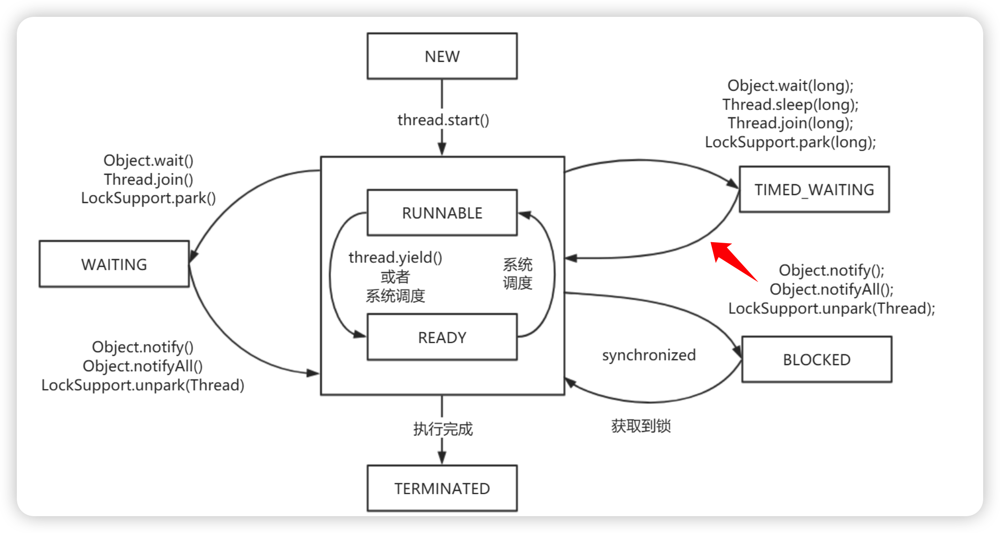

## 1、线程基础知识

`java.util.concurrent`  包作者：`Doug Lea` 大神

软件方面，充分利用多线程提高程序性能，产生的弊端有：1、线程安全问题，i++ ，集合类是否安全，线程锁问题，线程性能问题。
Java多线程相关概念：

1把锁：Synchronized 锁
2个并：
1. 并发 Concurrent，同样一个实体多个事件，同一时刻，其实只有一件事情。
2. 并行 Parallel，不同实体多个事件，同一时刻，你做你的，我做我的。
3个程：
1. 进程
2. 线程
3. 管程：监视器概念


### 1.1、用户线程与守护线程

一般情况不做特殊配置，默认都是用户线程。
+ 用户线程，独立线程，程序不会停
+ 守护线程，用户线程如果结束，守护线程就会结束

```java
Thread t1 = new Thread(() -> {...})
t1.setDaemon(true);
```

+ true 表示守护线程
+ false 表示用户线程（默认）
+ 在使用 setDaemon 时，要先 set 再 start，否则异常。


### 1.2、线程五大状态

1. 创建，new 新线程
2. 就绪，调用 start 方法，不一定立刻运行，等CPU调用
3. 运行，CPU 调用了
4. 阻塞，Sleep 
5. 死亡，执行完了，或者异常终止。


线程协作主要方法，Object 方法： wait 中断、notify 唤醒、notifyAll 唤醒


### 1.3、多线程理论

#### 1.3.1、基础理论

特征
1. 无论并发与否，启动必须创建 main 唯一线程
2. Java 中线程共享程序所有资源、内存、打开的文件
3. 线程优先级
	1. Thread.MIN_PRIORITY (1)
	2. Thread.NORM_PRIORITY (5) 默认 5
	3. Thread.MAX_PRIORITY (10) 1-10 之间，10优先级最高
4. 可以创建守护线程、非守护线程

状态
1. NEW Thread 已经创建，但还没有开始
2. RUNNABLE 正在运行
3. BLOCKED 正在等待锁定
4. WAITING 等待另一个线程动作
5. TIME_WAITING 等待另一个线程动作，但是有时间限制
6. TREMINATED 死亡

创建多线程方式

1. extends Thread
2. implements Runnable ，可以返回内容

通信概念
+ 共享内存 对共享内存区域读写实现通信
+ 信号量 计数器，访问前获取信号量，访问后释放信号量
+ 互斥锁 一个时间只能一个线程访问共享资源
+ 条件变量 等待通知机制，不满足条件等待，满足才执行
+ 管道 基于内存的通信，可具有父子进程间通信，或不同进程内不同线程间通信
+ 消息队列 进程间通信机制，生产-消费模式

Thread 主要方法
+ 获取 Thread 对象信息
    + getId() 返回对象标识符，正整数，唯一且无法改变
    + getName、SetName，允许你获取和设置名称
    + getPriority、setPriority 获取和设置优先级
    + isDaemon、setDaemon 获取和建立守护条件
    + getState() 获取对象状态
+ interrupt() 中断目标线程
+ interrupted() 判断线程是否被中断 且清除
+ isInterrupted() 判断是否被中断，不清除
+ sleep(long ms) 暂停ms时间
+ join() 只有等这个线程执行完，才会继续主线程
+ yield() 暂停线程，让CPU分配给其他线程
+ setUncaughtExceptionHandler() 设异常处理器
+ currentThead() 返回Thread对象

### 1.4、JVM内存模型指令重排

重排可见性：编辑器重排、CPU指令重排、CPU内存重排
happen-before 内存可见性概念？
volatile 功能
1. 64位写入的原子性
2. 内存可见性
3. 禁止直连重排