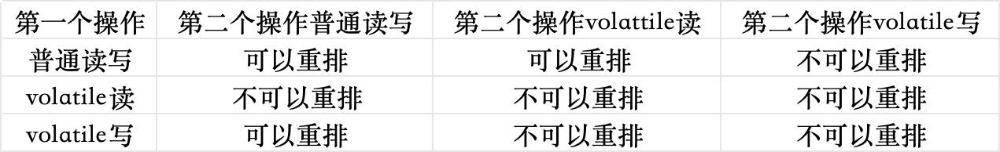

[toc]

## 1、什么是内存模型JMM

计算机硬件体系结构倒推过程JMM
由于 CPU 和内存速度差异，JVM 规范尝试使用 Java 内存模型，简称 JMM 来屏蔽硬件操作系统内访问差异

全程：Java Memory Model，一种抽象概念，仅仅描述一组规范，这组规范定义了程序中，各个变量读写访问方式，决定了一个线程对共享变量如何写入以及如何变成另一个线程可见，关键技术围绕多线程、原子性、可见性、有序性。

## 2、volatile 与 JMM

### 2.1、volatile 特点

可见性、有序性（禁止指令重排）
内存语意：
1. 写一个 volatile 变量时，JMM 会把本地内存中的共享变量刷回主内存
2. 读一个 volatile 内存时，JMM 会把本地内存设置成无效，重新回主内存读取最新共享变量
3. 所以 volatile 语义时直接操作主内存

volatile 如何保证可见性：内存屏障
volatile 是否具备原子性？不具备，容易导致写丢失，执行过程数据发生变更，丢失加工过程，重新加工。

### 2.2、如何正确使用 volatile

1. 单一赋值可以，复合运算不行，使用 synchronized 写，volatile 写
2. 状态标识，判断业务是否结束
3. 开销较低的读，写锁策略
4. DCL 双端锁的发布。

## 3、什么是内存屏障

保证有序性，禁止重排
happens-before

在深入理解 Java虚拟机中提到，volatile 不适合参与依赖当前值运算，例如 i++，更适合保持某个 boolean、或者 int
在JVM字节码中，i++ 分为3步，间隙期间不同步非原子操作

虽然指令重排提高了并发的性能，但是java虚拟机会对指令规则作出一些规则限制，并不能让所有的指令都能随意改变执行位置

1. 单线程每个操作，happen-before 于该线程中任意后续操作
2. volatile 写 happen-before 与后续对这个变量的读
3. synchronized 解锁 happen-before后续对这个锁的加锁
4. final 变量的写 happen-before于final域对象读写，happen-before 后续对final变量的读
5. 传递性规则，A先于B，B先于C，那么A一定先于C发生