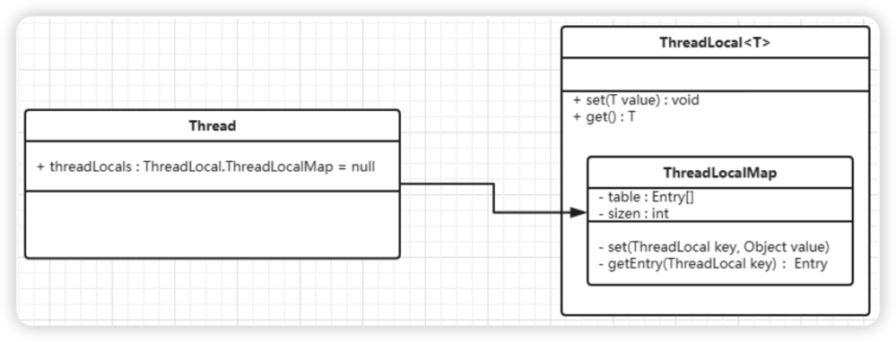
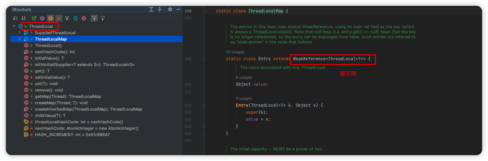
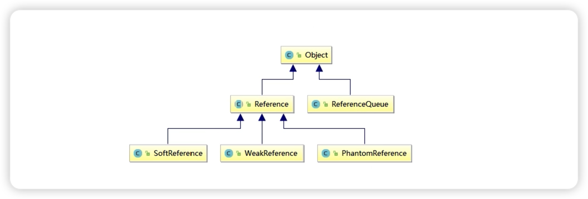
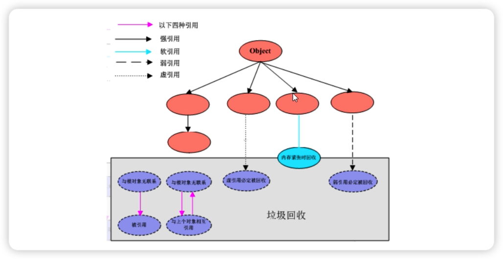
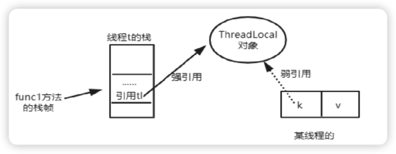

[toc]

定义：通过实现每个线程拥有自己专属变量副本，从而避免线程安全问题

## 1、ThreadLocal 中 ThreadLocalMap 数据结构和关系？

ThreadLocal 只是一个空壳子，真正存储结构是 ThreadLocal 里有个 ThreadLocalMap 内部类，每一个 Thread 对象维护一个 ThreadLocalMap ,内部用 Entiry 存储
set 方法时，实际上是往 ThreadLocalMap 设置值，value是传递进来的对象、get 也差不多
正因为如此，ThreadLocal 能够实现数据隔离，获取当前线程的局部变量，不受其他线程影响




## 2、ThreadLocal key 是弱引用，为什么？



引用：[006-收集器](../12-JVM/006-收集器.md)

1. 强引用：内存不足、JVM回收，对于强引用，OOM了，也不回收，死都不回收，唯一情况只能用 null 指向，没有引用关系后，被认为垃圾，具体看垃圾回收策略（造成内存泄漏主要原因）
2. 弱引用：只要垃圾一回收，不管JVM是否足够，都会回收掉
3. 软引用：看JVM空间够不够，不够的话，才会回收，GC也会回收
4. 虚引用：必须和引用队列 ReferenceQuene 联合使用，不管对象的生命周期，任何时候都会被回收，PhantoReference 的get 方法总是返回null，处理监控通知使用，设置虚引用的唯一目的，就是这个对象被收集器回收时收到一个系统通知或后续添加进一步处理，用来实现比 finalize 机制更灵活的回收操作





当 function1 方法执行完成后，栈帧销毁强引用 tl 也就没了，但此时线程的 ThreadLocalMap 里的某个 entry 的 key 还引用指向那个对象，

+  若这个key 引用是强引用，就会导致key指向的 ThreadLocal 对象及 v 指向的对象不能被 GC，造成内存泄漏。
+  若这个key 是 弱引用，大概率会减少内存泄漏问题，



### 2.1、引发 key 为 null 的原因？


因为使用 弱引用，当使用 tl 的get、set、remove方法时，就会尝试删除 key 为null的entry，释放value对象所占内存。

当我们为 ThreadLocal 变量赋值时，实际上就是当前 Entry 往这个 threadLocalMap 中存放，Entry 中的key 是弱引用，当 threadLocal 外部强引用被置为 null 时，那么系统 GC 时，根据可达性分析，这个 threadLocal 实例就没有任何一条链路能够引用到它， threadLocal 势必会被回收

1、这样一来，ThreadLocalMap 中就会出现key为null的entiry，就没办法访问到这些 value，如果当前线程迟迟不结束，这些 value 就会一直存在一条强引用链， Thread Ref -> Thread -> ThreadLocalMap -> Entry -> value 就永远无法回收。

2、如果 thread 提前结束，没有引用链可达，就能成功回收

3、实际系统中都会用线程池维护线程，为了复用线程是不会结束的，所以 ThreadLocal 内存泄漏就值得我们小心。

虽然弱引用，保证了 key 指向的 ThreadLocal 对象能够被及时回收，但是 v 指向的 value 对象需要 ThreadLocalMap 调用 get、set 时发现 key 为 null 时，才会回收整个 entry、value 因此弱引用不能 100%保证内存不泄漏，所以我们要在不使用 ThreadLocal 对象后，手动调用 remove 方法删除，尤其是线程池。


## 3、THreadLocal 内存泄漏问题你知道吗？

见问题：4、ThreadLocal 中为什么最后要加 remove 方法

## 4、ThreadLocal 中为什么最后要加 remove 方法

必须回收自定义的 ThreadLocal 变量尤其在线程池场景，线程会被复用，如果不清理，可能会影响后续业务逻辑存在内存泄露问题

+ `ThreadLocal.withInitial(() -> 初始值)` 避免空指针
+ 建议 Threadlocal 修饰为 static
+ 用完手动 remove


## 5、源码分析 Thread、ThreadLocal、ThreadLocalMap 关系

Thread 属性包括 ThreadLocalMap

ThreadLocal 方法有 set、get 成员变量是 ThreadLocalMap

```java
ThreadLocalMap - table: Entry[] - size: int set()、get()
```

ThreadLocalMap 是 ThreadLocal 的静态内部类
里面还有一个静态内部类 Entry 继承 WeakReference 弱引用

总结：JVM内部维护了一个线程版的 Map<ThreadLocal, value> 把自身线程当作key 放入 Map中

## 6、小总结

- ThreadLocal并不解决线程间共享数据的问题
- ThreadLocal适用于变量在线程间隔离且在方法间共享的场景
- ThreadLocal通过隐式的在不同线程内创建独立实例副本避免了实例线程安全的问题
- 每个线程持有一个只属于它自己的专属map并维护了ThreadLocal对象与具体实例的映射，该Map由于只被持有他的线程访问，故不存在线程安全以及锁的问题
- ThreadLocalMap的Entry对ThreadLocal的引用为弱引用。避免了ThreadLocal对象无法被回收的问题
- 都会通过expungeStaleEntry，cleanSomeSlots，replaceStaleEntry这三个方法回收键为null的Entry对象的值（即为具体实例）以及entry对象本身从而防止内存泄漏，属于安全加固的方法
- 群雄逐鹿起纷争，人各一份天下安