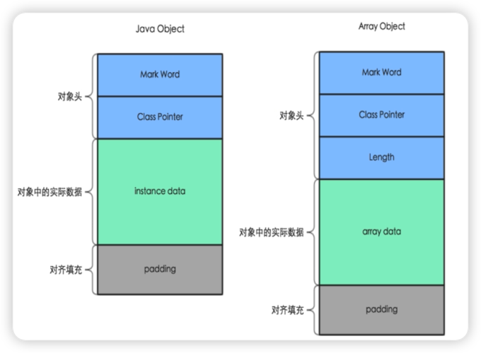
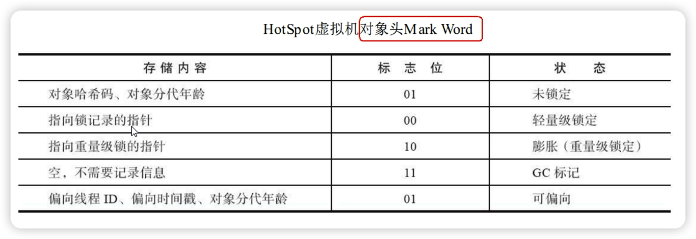
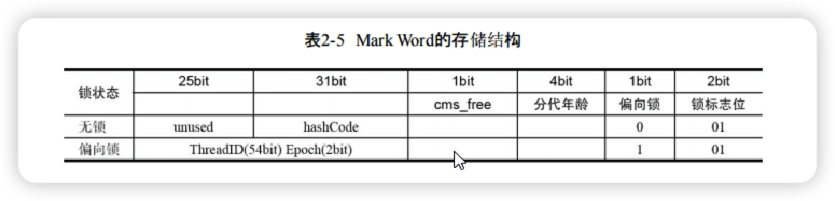
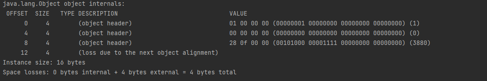
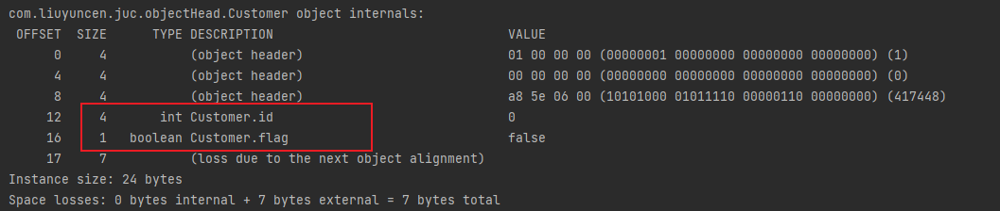
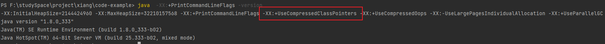

[toc]

## 1、Jdk8，new 一个对象占多数内存空间

位置布局：新生代（Eden、S0、S1）、老年代、方法区
构成布局：
1. 对象头 Header，对象标记 Markword 哈希码、GC标记、GC次数、同步锁状态、偏向所持有者 一共 8字节，类元信息，8字节
2. 实例数据，存放类的属性数据信息，包括父属性信息
3. 对其填充，虚拟机要求对象起始必须是 8 字节整倍数，不足补齐。



标记为标记对象（markOop）和类元素信息（klassOop），对应 Mark Word 和 Class Pointer



在 64位系统中，Mark Word 占用 8 个字节，类型指针占 8 个字节，一共 16 个字节。



## 2、JOL证明

官网：[https://openjdk.org/projects/code-tools/jol/](https://openjdk.org/projects/code-tools/jol/)

测试引用Maven

```xml
<dependency>
    <groupId>org.openjdk.jol</groupId>
    <artifactId>jol-core</artifactId>
    <version>0.9</version>
</dependency>
```

new一个对象查看对象大小

````java
Object o = new Object();
System.out.println(ClassLayout.parseInstance(o).toPrintable());
````



+ OFFSET：偏移量，也就是这个字段位置所占用的 byte 数
+ SIZE：后面类型的字节大小
+ TYPE：是 Class 中定义的类型
+ DESCRIPTION：DESCPTPTION 是类型的描述
+ VAULE：TYPE在内存中的值


通过上面的图，可以发现最后一句话“loss due to the next object alignment” 补齐8的倍数

```java
class Customer{
    int id;
    boolean flag = false;
}
```


因此也证明了 int 占4字节，boolean 占1字节

00000000 00000000 00000000 00000000 = 2^32 /2 = 2,147,483,648-1 



### JVM 分带年龄

最大为15，如果设置为16，则程序无法启动

```
-XX:MaxTenuringThreshold=16
```



默认开启压缩，所以 前面 Headers 头是4字节