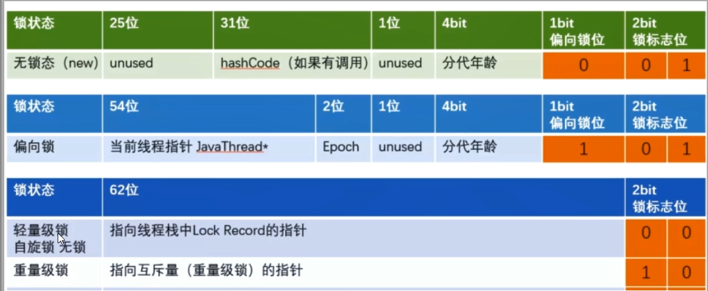
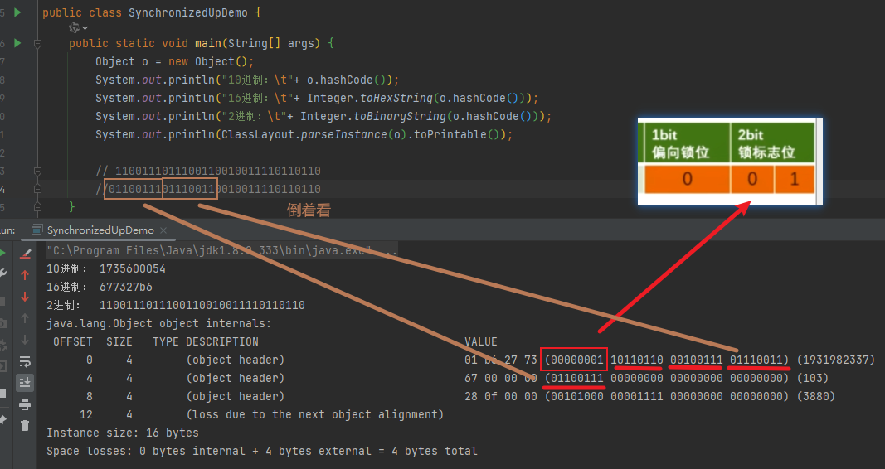
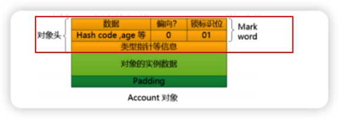
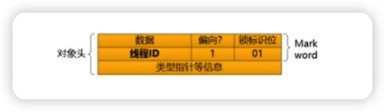

[toc]

## 1、Synchronized锁升级

过程 无锁 > 偏向锁 > 轻量锁 > 重量锁，
锁的指向
1. 偏向锁：MarkWord 存储的是偏向锁的线程 ID
2. 轻量锁：MarkWord 存储指向线程栈中的 Lock Record 指针
3. 重量锁：MarkWord 存储的是指向堆中的 monitor 对象指针

由对象头的 Mark Word 根据锁标志位的不同而被复用及锁升级策略

无锁，hashCode 如果有调用才有值，如果没有调用，是没有值的。全是0

+ 偏向锁：101
+ 轻量锁：000
+ 重量锁：010

Java5之前，用户态和内核态之间的切换

在早期版本，synchronized 属于重量级锁，效率低，因为监视器 monitor 是依赖于底层操作系统的 Mutex Lock 来实现的，挂起线程和恢复线程都需要转入内核态去完成，阻塞或唤醒一个 Java线程需要操作系统切换CPU状态来完成，这种切换需要耗费处理器时间，如果同步代码块中内容过于简单，这种切换的时间可能比用户代码执行时间更长，时间成本相对较高，这也是为什么早期的 synchronized 效率的原因，Java6之后，未来减少锁和释放锁带来的性能消耗，引入了轻量级锁和偏向锁

## 2、偏向锁

在实际应用运行中，发现，锁总是在同一个线程持有，很少发生竞争，也就是说，锁总是被第一个占用他的线程拥有，这个线程就是锁的偏向线程。也这样说非公平锁的特性。
那么只有需要在锁第一次被拥有时记录，记录下偏向线程ID，这样偏向锁就一直持有，如果自始至终使用锁的线程只有1个，很明显偏向锁几乎没有开销，性能极高。
如果不等，表示发生了竞争，就会尝试CAS来替换 MarkWord里的线程ID为新线程ID

+ 竞争成功，为新ID，锁不会升级，仍然为偏向锁
+ 竞争失败，就可能需要升级为轻量锁，才能保证线程间公平竞争

注意：偏向锁只有遇到其他线程尝试竞争时，持有偏向锁的线程才会释放锁，线程是不会主动释放偏向锁的。

偏向锁的操作不用直接捅到操作系统，不涉及用户到内核转化，不必直接升级为最高级，我们可以以一个 account 对象的 对象头为例

假设有一个线程执行到了 synchronized 代码，JVM 使用 CAS 操作把线程指针 ID 记录到 MarkWord 中，并修改偏向标志，标识当前线程就获得该锁，锁对象变成偏向锁，字面意思是 偏向于第一个获得它的线程，执行完同步代码块之后，线程并不会主动释放偏向锁

这时线程获得了锁，可以执行同步代码块，当该线程第二次到达同步代码块时会判断此时持有线程是否还是自己，JVM通过 account 对象的 MarkWord 判断，当前线程ID还在，说明持有这个对象锁，就可以继续进入临界区工作，由于之前没有释放锁，这里就不用重新加锁，如果自始至终使用锁的线程只有1个，很明显偏向锁几乎没有开销，性能极高。

JVM不用和操作系统协商设置 Mutex 争取内核，他只需要记录下线程ID就标识自己获得了当前锁，不用操作系统介入。

---

jdk15 之后，就废弃了偏向锁， 2020年9月15日发布的 Jdk15，其中在 JEP314 中在 2021年8月28日，发布抛弃偏向锁。目的是耗费成本高，Hotspot作者发现，多线程情况下，锁不仅存在多线程竞争，还存在锁由同一个线程多次获得的情况。

JVM参数，`java -XX:+PrintFlagsInitial | grep BiasedLock*` 查找偏向锁相关信息

+ `-XX:+UseBiasedLocking` 默认开启偏向锁
+ `-XX:BiasedLockingStartupDelay=0`  关闭延迟，演示偏向锁时需要开启，也可以不设置这个参数，程序启动后等待5秒，查看MarkWord 锁标志位
+ `-XX:-UseBiasedLocking` 关闭偏向锁，程序直接进入轻量级锁状态

## 3、轻量级锁

主要作用：

多线程竞争，但是任意时刻最多只有一个线程竞争，既不存在锁竞争太过于激烈的情况，也就没有线程阻塞。

轻量锁是为了线程近乎交替执行同步代码块时提高性能。
主要目的：在没有多线程竞争条件下，通过CAS 减少重量级锁使用操作系统互斥产生的性能消耗，说白了 先自旋，不行再升级阻塞。
升级时机：当关闭偏向锁功能或多线程竞争导致偏向锁升级为轻量锁。

1. 假设线程A已经拿到锁，此时线程B又来抢锁，由于该对象的锁已经被A拿到，当前锁已经是偏向锁了。
2. 而线程B在争抢过程中发现 MarkWord 的线程ID不是不是线程B，那么线程B就会进行 CAS 操作希望获得锁。

此时会有2种情况，

1. 获取锁 `成功`，直接替换 MarkWord 中线程ID为 B，重新偏向锁于其他线程，锁仍旧保持偏向锁状态，
2. 获取锁 `失败`，则偏向锁升级为轻量级。此时轻量锁由原本偏向锁持有者持有，线程B继续自旋等待。

### 3.1、轻量锁加锁

JVM会为每个线程在当前线程的栈帧中创建用于存储记录的空间，官方称为 Displace Mark Word，若一个线程获得当前锁时，发现是轻量锁，会把锁的 Mark Word 复制到自己的 Displace Mark Word 里面，然后线程尝试用 CAS 将锁 Mark Word 替换为指向锁记录的指针，如果成功，当前线程获得锁，如果失败，表示 Mark Word 已经被替换成了其他锁记录，说明在其他线程竞争锁，当前锁就尝试使用自旋来获取。

### 3.2、升级重量锁

自适应自旋锁大致原理：线程如果自旋成功了，那下次自旋的最大次数会增加，因为JVM认为既然上次成功了，那么下一次大概率会成功。反之，如果自旋成功很少，就会减少自旋次数，甚至不自旋，避免CPU空转。

## 4、重量锁

Java 中 synchronzied 的重量锁，是基于进入和退出 Monitor 对象实现的，在编译时会将同步代码块开始位置插入 monitor enter 指令，在结束位置插入 monitor exit指令，当线程执行到 monitor enter 指令，会尝试获取对象锁对应的 Monitor 所有权，如果获取到了，即获取到了锁，会在 Monitor 的 owner 中存放当前线程id，这样他将处于锁定状态，除非退出同步块，否则其他线程无法获取到 monitor。

### 4.1、锁升级后，hashCode 哪去了？

升级后，Mark Word 中保存的分别是 线程栈里的锁记录指针 和 重量级锁指针，已经没有位置保存哈希吗，GC年龄了，这些信息移动到哪里去了？

在无锁状态下，Mark Word 中可以存储对象的 identity hash code 值，当对象 hashCode() 方法第一次被调用时，JVM会生成对应 identity hash code 并将其存储到 Mark Word

对于偏向锁，在线程获取偏向锁时，会用 Thread ID和 epoch 值覆盖 identity hash code所在位置，如果一个对象的 hashcode 方法已经被调用过一次之后，这个对象不能被设置偏向锁，因为如果可以的话，那么 Mark word 中的 identity hash code 必然会被偏向线程覆盖，这样就造成了同一个对象前后两次调用 hashCode 方法得到结果不一致。

升级为轻量锁时，JVM会在当前线程的栈帧中创建一个锁记录，Lock Record 空间，用于存储锁对象的 Mark word 拷贝，该拷贝中可以包含 identity hash code，所以轻量锁可以和 identity hash code 共存，哈希码和GC年龄自然保存在在此，释放锁后这些信息会被写回对象头。

升级为重量锁时，不再栈帧里了，在堆里了。

---

Synchronized解析，捡田螺的小男孩：[http://www.360doc.com/content/20/0602/17/70282097_916085028.shtml](http://www.360doc.com/content/20/0602/17/70282097_916085028.shtml)