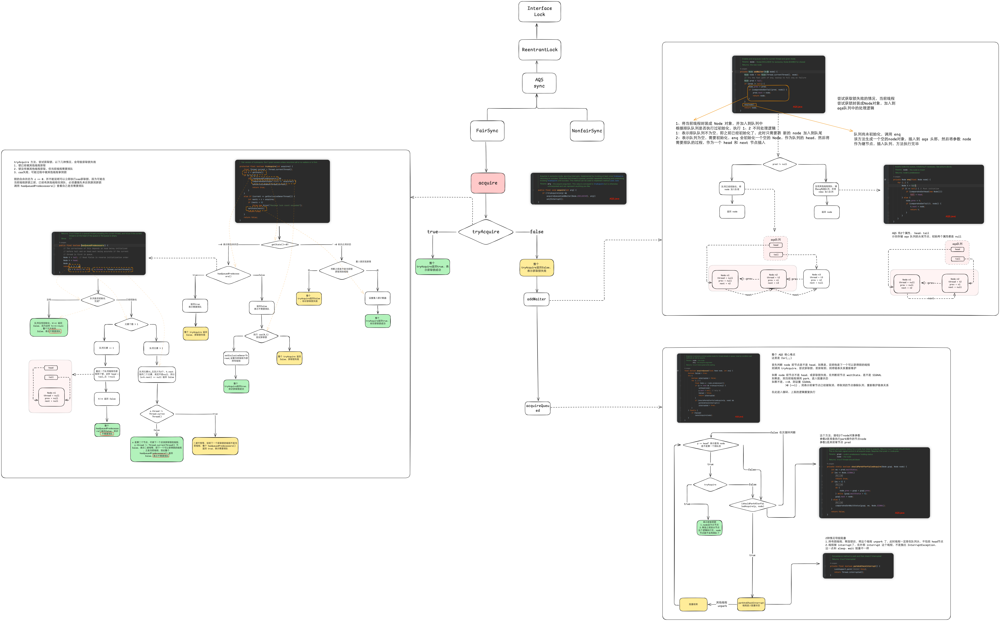

[toc]

## 1、前置知识

1. 公平锁与非公平锁
2. 可重入锁
3. 自旋思想
4. LockSupport
5. 数据结构之双向链表
6. 设计模式之模版设计模式

## 2、AQS入门级理论

AQS：抽象队列同步器

+ 是用来实现锁或者其他同步器组件的公共基础部分的抽象实现
+ 是重量级基础框架及整个JUC体系的基石，只要用于解决锁分配给”谁“的问题。
+ 整体就是一个抽象的FIFO队列来完成资源获取线程的排队工作，并通过一个int类变量表示持有锁的状态

### 2.1、CountDownLatch

+ 通过计数器实现，计数器的初始值是线程数量，每当线程完毕后，计数器-1，当为0时，表示所有线程结束
+ await 方法会挂起，等待 count 值为0 才继续执行
+ await(timeout,unit) 等待一段时间后还没有为0就会继续执行
+ countDown() coun值-1

### 2.2、ReentrantLock

对比 Synchronized 

+ synchronized 获取锁无法设置超时，RenntrnatLock 可以设置超时时间
+ sync 无法实现公平锁，lock 可以实现
+ sync 是 Java 关键字，无法提供外部方法，lock 是 JUC 一种实现，方法很多
+ sync 在加锁块出现异常，自动释放，lock 不会释放，需要在 finlay 显示释放

锁实现

+ 公平锁 FairSync
+ 非公平锁 非公平锁 NonFairSync

### 2.3、Samaphore 信号量

+ 称之为信号灯，多线程环境下协调各个线程，保证正确合理的使用资源
+ 操作方式
	+ acquire 得到许可，然后对临界资源进行操作
	+ release 线程释放一个许可，归还 semaphore （必须1:1对应）

### 2.4、CyclicBarrier

+ 类似 CoutDownLatch，阻塞一组线程直到条件发生，与 CountDownLatch 区别，所有线程必须满足条件，CountDownLatch 用于事件等待，而 Cy 用于等待其他线程
+ await 告诉其他线程已经达到同步点，然后当前线程阻塞
+ Cy 同样提供超时 await 方法
+ CoutDownLatch 基于 AQS，Cy 基于 Condition 实现

### 2.5、ReentrantReadWriteLock

1. JUC 下，表示2个锁，一个读操作相关，一个写操作相关
2. 3个重要特性
	1. 公平性选择：支持非公平（默认非公平）
	2. 可重入
	3. 锁降级：遵循获取写锁，获取读锁在释放写锁次序，写锁能降级为读锁


## 3、AQS 源码分析

系统架构图


### 3.1、AQS自身成员变量 state 状态位、Node 队列

```java
private volatile int state;
```

```
static final class Node{...}
```

一个 state 状态位，比喻红绿灯，Node 是一个双向队列，他们叫 `CLH` （就是三个大佬的名字），等于 0 就是绿灯，排着队过马路，大于 0，就是红灯，有人占着呢，等着吧！

### 3.2、AQS解析Node队列


## 4、AQS 深度解析

Lock 接口的实现类，基本都是通过聚合了AQS完成的。





美团技术团队：从 ReentrantLock 实现来看 AQS 原理：[https://tech.meituan.com/2019/12/05/aqs-theory-and-apply.html](https://tech.meituan.com/2019/12/05/aqs-theory-and-apply.html)
语雀，JUC并发编程：[https://www.yuque.com/gongxi-wssld/csm31d/fww7kvpb2cyqv3ze](https://www.yuque.com/gongxi-wssld/csm31d/fww7kvpb2cyqv3ze)