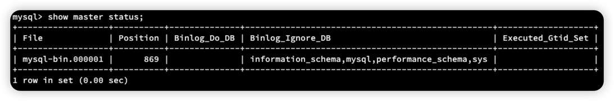
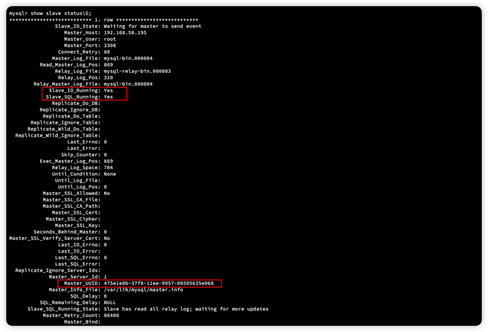
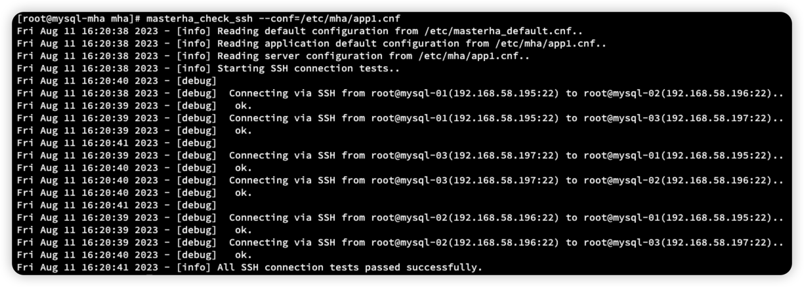
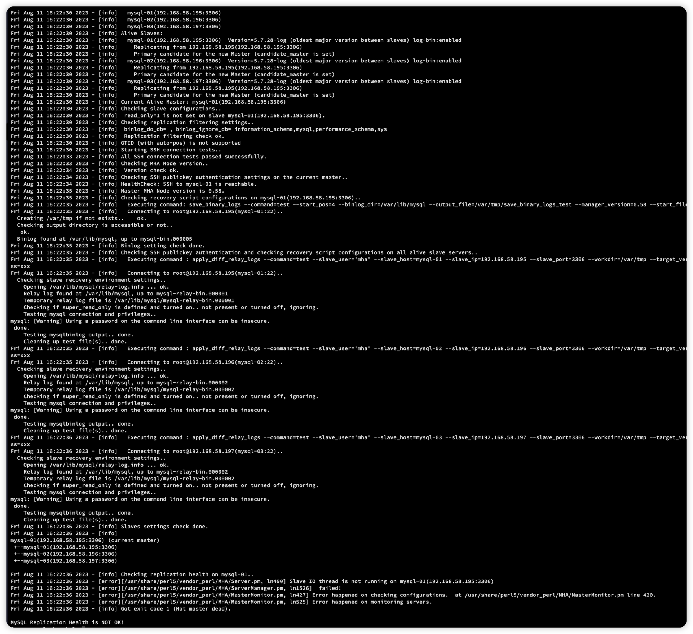
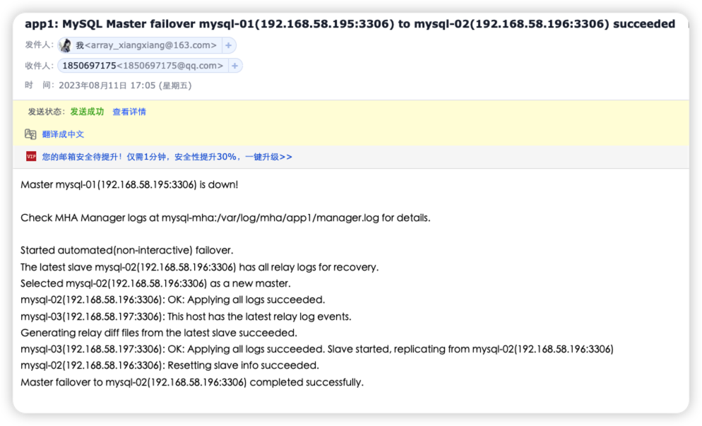

[toc]

## 1、准备工作

前期准备工作：MHA 集群至少4台机器

1主、2从、1管理

- 192.168.58.195 master 主库、可读可写
- 192.168.58.196 salve-01 从库 只读
- 192.168.58.197 salve-02 从库 只读
- 192.168.58.198 manager 管理库

### 1.1、下载 MySQL 数据库


安装下载工具

```sh
yum install -y wget
```

下载 mysql

```sh
wget https://cdn.mysql.com/archives/mysql-5.7/mysql-5.7.28-1.el7.x86_64.rpm-bundle.tar
```

移除 CentOS 自带 mariabd-lib 依赖，避免冲突

```sh
[root@centos ~]# rpm -qa|grep mariadb
mariadb-libs-5.5.68-1.el7.x86_64
[root@centos ~]# rpm -e mariadb-libs-5.5.68-1.el7.x86_64  --nodeps
```

rpm 常用命令

```sh
-i, --install 安装软件包
-v, --verbose 可视化，提供更多的详细信息的输出
-h, --hash 显示安装进度
-U, --upgrade=<packagefile>+ 升级软件包
-e, --erase=<package>+ 卸载软件包
--nodeps 不验证软件包的依赖
```

组合可以得到以下命令

```sh
安装软件：rpm -ivh rpm包名
升级软件：rpm -Uvh rpm包名
卸载软件：rpm -e rpm包名
查看某个包是否被安装 rpm -qa | grep 软件名称
```


### 1.2、安装 MySQL 数据库

解压 tar包

```sh
tar xvf mysql-5.7.28-1.el7.x86_64.rpm-bundle.tar
```

需要严格安装顺序执行

```sh
rpm -ivh mysql-community-common-5.7.28-1.el7.x86_64.rpm
rpm -ivh mysql-community-libs-5.7.28-1.el7.x86_64.rpm
rpm -ivh mysql-community-libs-compat-5.7.28-1.el7.x86_64.rpm
rpm -ivh mysql-community-client-5.7.28-1.el7.x86_64.rpm
rpm -ivh mysql-community-server-5.7.28-1.el7.x86_64.rpm
rpm -ivh mysql-community-devel-5.7.28-1.el7.x86_64.rpm
```


执行到第5步报错

```sh
[root@centos ~]# rpm -ivh mysql-community-server-5.7.28-1.el7.x86_64.rpm
警告：mysql-community-server-5.7.28-1.el7.x86_64.rpm: 头V3 DSA/SHA1 Signature, 密钥 ID 5072e1f5: NOKEY
错误：依赖检测失败：
        /usr/bin/perl 被 mysql-community-server-5.7.28-1.el7.x86_64 需要
        net-tools 被 mysql-community-server-5.7.28-1.el7.x86_64 需要
        perl(Getopt::Long) 被 mysql-community-server-5.7.28-1.el7.x86_64 需要
        perl(strict) 被 mysql-community-server-5.7.28-1.el7.x86_64 需要
```

处理方案：

```sh
yum install -y perl-Module-Install.noarch
yum install -y net-tools 
```


```sh
[root@centos ~]# systemctl status mysqld
● mysqld.service - MySQL Server
   Loaded: loaded (/usr/lib/systemd/system/mysqld.service; enabled; vendor preset: disabled)
   Active: inactive (dead)
     Docs: man:mysqld(8)
           http://dev.mysql.com/doc/refman/en/using-systemd.html
```

发现 MySQL 服务已经安装成功，但是没有启动

### 1.3、启动 MySQL 数据库

初始化用户

```sh
mysqld --initialize --user=mysql
```

查看用户密码

```sh
[root@centos ~]# cat /var/log/mysqld.log | grep password
2023-08-11T03:36:39.052992Z 1 [Note] A temporary password is generated for root@localhost: e<du&o//-9,K
```

**启动服务**

```sh
systemctl start mysqld
```

设置开机自启

```sh
systemctl enable mysqld
```

再次验证

```sh
[root@centos ~]# systemctl status mysqld
● mysqld.service - MySQL Server
   Loaded: loaded (/usr/lib/systemd/system/mysqld.service; enabled; vendor preset: disabled)
   Active: active (running) since 五 2023-08-11 11:37:29 CST; 34s ago
     Docs: man:mysqld(8)
           http://dev.mysql.com/doc/refman/en/using-systemd.html
 Main PID: 1519 (mysqld)
   CGroup: /system.slice/mysqld.service
           └─1519 /usr/sbin/mysqld --daemonize --pid-file=/var/run/mysqld/mysqld.pid

8月 11 11:37:28 centos systemd[1]: Starting MySQL Server...
8月 11 11:37:29 centos systemd[1]: Started MySQL Server.
```

MySQL 正常启动


```sh
mysql -uroot -p
xxxxxx输入初始密码 (e<du&o//-9,K)
mysql> SET PASSWORD = PASSWORD('123456');
Query OK, 0 rows affected, 1 warning (0.00 sec)
```

### 1.4、记得关闭防火墙

```sh
systemctl stop firewalld
```

开机关闭

```sh
systemctl disable firewalld
```

## 2、克隆服务器

将之前安装的节点 192.168.58.195 复制2台出来

- 192.168.58.196
- 192.168.58.197

修改虚拟机配置，重新生产网络MAC

修改IP地址

```sh
 vi /etc/sysconfig/network-scripts/ifcfg-ens33
```

分别启动三台服务器

### 2.1、主从配置

#### 2.1.1、master 配置


**vi /etc/my.cnf**

```properties
#bin_log配置
log_bin=mysql-bin
server-id=1
sync-binlog=1
binlog-ignore-db=information_schema
binlog-ignore-db=mysql
binlog-ignore-db=performance_schema
binlog-ignore-db=sys
#relay_log配置
relay_log=mysql-relay-bin
log_slave_updates=1
relay_log_purge=0
```

重启 Master MySQL 

```sh
systemctl restart mysqld
```

登陆主库

```sh
mysql -uroot -p123456
```

授权登陆、查看主库状态

```sh
mysql> grant replication slave on *.* to root@'%' identified by '123456';
Query OK, 0 rows affected, 1 warning (0.00 sec)

mysql> grant all privileges on *.* to root@'%' identified by '123456';
Query OK, 0 rows affected, 1 warning (0.00 sec)

mysql> flush privileges;
Query OK, 0 rows affected (0.00 sec)

mysql> show master status;
```




得到信息 `File: mysql-bin.000001` `Position:869`

> 192.168.58.196 Slave-01 从库-01 配置
>
> 192.168.58.197 Slave-02 从库-02 配置 （和1差不多没多大区别）

**vi /etc/my.cnf**

```properties
#bin_log配置
log_bin=mysql-bin
#服务器ID,从库1是2,从库2是3     (注意)
server-id=2
sync-binlog=1
binlog-ignore-db=information_schema
binlog-ignore-db=mysql
binlog-ignore-db=performance_schema
binlog-ignore-db=sys
#relay_log配置
relay_log=mysql-relay-bin
log_slave_updates=1
relay_log_purge=0
read_only=1
```

重启 Master MySQL 

```sh
systemctl restart mysqld
```

登陆主库

```sh
mysql -uroot -p123456
```

授权登陆、查看主库状态

> 192.168.58.196 执行：
>
> 192.168.58.197 执行：

执行前测试 从节点是否可以访问主库

```sh
# slave-1. slave2 执行
mysql -h192.168.58.195 -P3306 -uroot -p123456
```

因为我们是拷贝到服务器，所以里面的文件都会一样，但MySQL 会有一个唯一ID UUID

```sh
mysql> select uuid();
+--------------------------------------+
| uuid()                               |
+--------------------------------------+
| 0daaed49-3812-11ee-8140-00505621ff6a |
+--------------------------------------+
1 row in set (0.00 sec)
```

生成一个UUID再放进去，保证三台服务器的  `/var/lib/mysql/auto.cnf` UUID 唯一性

```sh
vi /var/lib/mysql/auto.cnf
[auto]
server-uuid=4cd0549e-3811-11ee-8140-00505621ff6a
```

```sh
mysql> change master to master_host='192.168.58.195',master_port=3306,master_user='root',master_password ='123456',master_log_file='mysql-bin.000007',master_log_pos=417;

# 开启同步
mysql> start slave;
# 关闭同步
# mysql> stop slave;
# 查看同步情况
mysql> show slave status\G;
```

看到这里就表示成功了




### 2.2、配置版同步复制

#### 2.2.1、master 配置


> 192.168.58.195 Master 节点操作
>
> `install plugin rpl_semi_sync_master soname 'semisync_master.so';`
>
> `show variables like '%semi%';`

```sh
mysql> install plugin rpl_semi_sync_master soname 'semisync_master.so';
Query OK, 0 rows affected (0.01 sec)

mysql> show variables like '%semi%';
+-------------------------------------------+------------+
| Variable_name                             | Value      |
+-------------------------------------------+------------+
| rpl_semi_sync_master_enabled              | OFF        |
| rpl_semi_sync_master_timeout              | 10000      |
| rpl_semi_sync_master_trace_level          | 32         |
| rpl_semi_sync_master_wait_for_slave_count | 1          |
| rpl_semi_sync_master_wait_no_slave        | ON         |
| rpl_semi_sync_master_wait_point           | AFTER_SYNC |
+-------------------------------------------+------------+
6 rows in set (0.01 sec)
```

修改 `/etc/my.cnf `配置文件

```properties
# 自动开启半同步复制
rpl_semi_sync_master_enabled=ON
rpl_semi_sync_master_timeout=1000
```

重启 Master MySQL

```sh
systemctl restart mysqld
```

#### 2.2.2、 slave 节点操作

登陆 mysql 执行

```sh
#再登陆本地mysql执行
mysql -uroot -p123456

mysql> install plugin rpl_semi_sync_slave soname 'semisync_slave.so';
Query OK, 0 rows affected (0.01 sec)

mysql> set global rpl_semi_sync_slave_enabled=1;
Query OK, 0 rows affected (0.00 sec)
```

修改 `/etc/my.cnf `配置文件

```properties
# 自动开启半同步复制
rpl_semi_sync_slave_enabled=ON
```

重启 Master MySQL

```sh
systemctl restart mysqld
```

查看半同步状态

```sh
mysql> show variables like '%semi%';
+---------------------------------+-------+
| Variable_name                   | Value |
+---------------------------------+-------+
| rpl_semi_sync_slave_enabled     | ON    |
| rpl_semi_sync_slave_trace_level | 32    |
+---------------------------------+-------+
2 rows in set (0.00 sec)
```

## 3、MHA高可用搭建


配置 hosts

```
192.168.58.195 mysql-01
192.168.58.196 mysql-02
192.168.58.197 mysql-03
192.168.58.198 mysql-mha
```

修改hosts-name

```sh
hostnamectl set-hostname mysql-01
```

做免密

```sh
ssh-keygen -t rsa
# 四台服务器分别执行
ssh-copy-id mysql-01
ssh-copy-id mysql-02
ssh-copy-id mysql-03
ssh-copy-id mysql-mha
```

时间同步

```sh
yum install -y ntpdate
# 同步阿里云时间
ntpdate -u ntp.aliyun.com

# 做定时任务 避免虚拟机挂起导致的延迟
crontab -e
* * * * * /usr/sbin/ntpdate -u ntp.aliyun.com > /dev/null 2>&1
```

下载工具


```
https://github.com/yoshinorim/mha4mysql-node/releases/download/v0.58/mha4mysql-node-0.58-0.el7.centos.noarch.rpm
https://github.com/yoshinorim/mha4mysql-manager/releases/download/v0.58/mha4mysql-manager-0.58-0.el7.centos.noarch.rpm
```

### 3.1、安装 Node

> 4台服务器 都执行

**三台 MySQL 数据库需要安装 Node**

**MHA 需要安装 Manager 和 Node**

传输命令：`scp mha4mysql-node-0.58-0.el7.centos.noarch.rpm mysql-01:~/`

Node 依赖于 perl-DBD-MySQL 需要先安装

```sh
yum install -y perl-DBD-MySQL
```

确保4台服务器上都有 `yum install -y perl-DBD-MySQL` （安装很快）

```sh
[root@mysql-01 ~]# rpm -ivh mha4mysql-node-0.58-0.el7.centos.noarch.rpm
准备中...                          ################################# [100%]
正在升级/安装...
   1:mha4mysql-node-0.58-0.el7.centos ################################# [100%]
```

### 3.2、安装 Manager

Manager 依赖的东西蛮多，我们挨个下载并安装

```sh
wget http://dl.fedoraproject.org/pub/epel/epel-release-latest-7.noarch.rpm
rpm -ivh epel-release-latest-7.noarch.rpm
yum install perl-DBD-MySQL perl-Config-Tiny perl-Log-Dispatch perl-Parallel-ForkManager -y
# 之前下载好了得
rpm -ivh mha4mysql-manager-0.58-0.el7.centos.noarch.rpm
```

> 提示：由于perl-Log-Dispatch和perl-Parallel-ForkManager这两个被依赖包在yum仓库找不到，因此安装epel-release-latest-7.noarch.rpm。在使用时，可能会出现下面异常：**Cannot retrieve metalink for repository: epel/x86_64**。可以尝试使用/etc/yum.repos.d/epel.repo，然后注释掉metalink，取消注释baseurl。


### 3.3、MHA 配置

MHA Manager 服务器需要为每个监控的 Master 、Slave 集群提供一个专用的配置文件，而所有的 Master、 Slave 集群也可以共享全局配置

```sh
#目录说明 #/var/log (CentOS目录) 
# 	/mha (MHA监控根目录) 
# 		/app1 (MHA监控实例根目录)
# 			/manager.log (MHA监控实例日志文件)
mkdir -p /var/log/mha/app1
touch /var/log/mha/app1/manager.log
```

配置监控全局配置文件

`vi /etc/masterha_default.cnf`

```properties
[server default]
#主库用户名，在master mysql的主库执行下列命令建一个新用户
#create user 'mha'@'%' identified by '123456';
#grant all on *.* to mha@'%' identified by '123456';
#flush privileges;
user=mha
password=123456
port=3306
#ssh登录账号
ssh_user=root
#从库复制账号和密码
repl_user=root
repl_password=123456
port=3306 
#ping次数
ping_interval=1
#二次检查的主机
secondary_check_script=masterha_secondary_check -s mysql-01 -s mysql-02 -s mysql-03
```

配置监控实例配置

```sh
mkdir -p /etc/mha
vi /etc/mha/app1.cnf
```

`app1.cnf`

```properties
[server default]
#MHA监控实例根目录
manager_workdir=/var/log/mha/app1
#MHA监控实例日志文件
manager_log=/var/log/mha/app1/manager.log
#[serverx] 服务器编号
#hostname 主机名
#candidate_master 可以做主库
#master_binlog_dir binlog日志文件目录

[server1]
hostname=mysql-01
candidate_master=1
master_binlog_dir="/var/lib/mysql"

[server2]
hostname=mysql-02
candidate_master=1
master_binlog_dir="/var/lib/mysql"

[server3]
hostname=mysql-03
candidate_master=1
master_binlog_dir="/var/lib/mysql"
```

### 3.4、测试

测试 SSH 连通性，在 MHA 服务器上执行

```sh
masterha_check_ssh --conf=/etc/mha/app1.cnf
```



测试主从复制

```sh
masterha_check_repl --conf=/etc/mha/app1.cnf
```




最后一句出现了：**MySQL Replication Health is  OK!**  就OK啦

> 像我这样，最后发生了个 Not OK ，去主库执行一下，重新执行一边就ok了
>
> ```sh
> mysql> reset slave all;
> Query OK, 0 rows affected (0.01 sec)
> ```

### 3.5、启动监控

```sh
nohup masterha_manager --conf=/etc/mha/app1.cnf --remove_dead_master_conf --ignore_last_failover < /dev/null > /var/log/mha/app1/manager.log 2>&1 &
```

查看监控状态

```sh
masterha_check_status --conf=/etc/mha/app1.cnf
```

查看日志

```sh
tail -f /var/log/mha/app1/manager.log
```

手动切换主从节点（运维）

```sh
masterha_master_switch --conf=/etc/mha/app1.cnf --master_state=alive --new_master_host=mysql-02 --orig_master_is_new_slave
```


## 4、模拟主节点宕机

> 192.168.58.195 Master 执行

```sh
[root@mysql-01 ~]# systemctl stop mysqld
```



监控告警！

然后主动切换 mysql-02 节点为主节点
