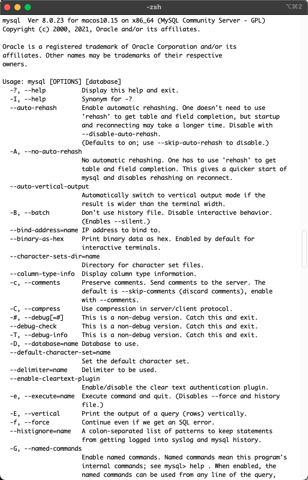

[toc]

ERROR 1290 (HY000) at line 1: The MySQL server is running with the --secure-file-priv option so it cannot execute this statement

工作场景 将查询到的数据写入到文件中

首先使用 `mysql -h localhost -P 3306 -u cxeast -pcxeast` 命令登入数据库 执行->

```sql
mysql> SELECT SJKZRZJHM , SJKZRMC, LSH  FROM D0101_JGXXB WHERE SJBSPCH =  '20201231'AND SJKZRBZ = 'Y'  into outfile '/Users/xiang/xiang/compile/cxeast/mysql/tmtxt/D0101_JGXXB.txt' CHARACTER set utf8 fields terminated by 0x01 lines terminated by 0x0A;
```

解释上述语句

```sql
SELECT SJKZRZJHM , SJKZRMC, LSH  FROM D0101_JGXXB WHERE SJBSPCH =  '20201231'AND SJKZRBZ = 'Y' 
-- 数据库查询语句
into outfile '/Users/xiang/xiang/compile/cxeast/mysql/tmtxt/D0101_JGXXB.txt' 
-- 将查询到的语句放入次文件夹中
CHARACTER set utf8 fields terminated by 0x01 
-- SJKZRZJHM、SJKZRMC、LSH 字段中使用 0x01  字符间隔 ，理解为 行间隔
lines terminated by 0x0A 
-- 列间隔， 0x0A 就是换行符
```


执行后，报错：

==ERROR 1290 (HY000): The MySQL server is running with the --secure-file-priv option so it cannot execute this statement==


## 解决办法：

**首先**  使用mysql 语句查询 secure_file_priv 对应的值

```sql
show global variables like '%secure_file_priv%';
```

```sh
mysql> show global variables like '%secure_file_priv%';
+------------------+-------+
| Variable_name    | Value |
+------------------+-------+
| secure_file_priv | NULL  |
+------------------+-------+
1 row in set (0.01 sec)
```

查看 secure_file_priv 的值，默认为NULL，表示限制不能导入导出。

查看官方文档，secure_file_priv参数用于限制LOAD DATA, SELECT …OUTFILE, LOAD_FILE()传到哪个指定目录。

secure_file_priv 为 NULL 时，表示限制mysqld不允许导入或导出。
secure_file_priv 为 /tmp 时，表示限制mysqld只能在/tmp目录中执行导入导出，其他目录不能执行。
secure_file_priv 没有值时，表示不限制mysqld在任意目录的导入导出。
又因为 secure_file_priv 参数是只读参数，不能使用set global命令修改。

```sh
mysql> set global secure_file_priv='';
ERROR 1238 (HY000): Variable 'secure_file_priv' is a read only variable
mysql> exit;
```


**此时** 需要配置 my.cnf 

> 避坑：mysql 5.7 之后，就不会自动生成 my.cnf 了，如果不是自己创建，往死里找都找不到！

这时，我们查询一下，mysql 查询配置文件的先后顺序

```sh
mysql --verbose --help | grep my.cnf
```





我们可以找到下面这段语句

```sh
Default options are read from the following files in the given order:
/etc/my.cnf /etc/mysql/my.cnf /usr/local/mysql/etc/my.cnf /usr/local/mysql/bin/my.cnf ~/.my.cnf
```

通过这段输出，我们可以确定，先后顺序是：

`/etc/my.cnf ` > `/etc/mysql/my.cnf` > `/usr/local/mysql/etc/my.cnf` > `/usr/local/mysql/bin/my.cnf` > `~/.my.cnf`

因为我的mysql 在  /usr/local/mysql/ 这个路径下，所以我选择在这个路径创建一个 etc/my.cnf

**==重要，配置如下==**

重要的来了，因为我们要修改 secure_file_priv 的值，所以，配置应该这么写

```cnf
[mysqld]
secure_file_priv=''
```

一定记住，如果是新建的 my.cnf 一定要加 `[mysqld]` 开头，如果有了，就不用加了，没有的话，重启mysql会报错

在此查询：

```sh
mysql> show global variables like '%secure_file_priv%';
+------------------+-------+
| Variable_name    | Value |
+------------------+-------+
| secure_file_priv |       |
+------------------+-------+
1 row in set (0.00 sec)
```

配置完成后，在此执行一开始的命令，文件生成成功！