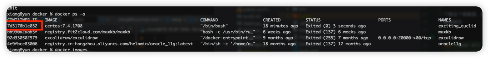

> [!Note]
> 如果有人问你技术厉不厉害，我会告诉他我很菜，什么都只会一点点。但在面对问题的时候，我将会是集无限Title于一身的互联网之神，哈哈哈哈！


问题背景：运行在 Docker 中的 SpringBoot 需要执行 Python 脚本，但基础镜像内未提供 python 环境，这个容器具有 CI/CD 能力，即使在容器内执行一次安装，下次版本发布时，将会丢失 python 环境。


### 解决方案 1：基于 openjdk 镜像赋能

普通使用 -v 挂载，将 python 工作目录挂在到 container 中，肯定无法执行，因为没有 python3 环境

考虑使用基于 openjdk 镜像内下载 python 环境，发现无法执行成功

### 方案2：从CentOS从0构建

获取基础镜像

```sh
docker pull centos:7.4.1708
```

进入容器内部

```sh
docker run -i -t centos:7.4.1708 /bin/bash
```

因为 yum 源不对，又没有 wget 工具，手动从浏览器下载 阿里的镜像源然后手动 vim 进去

```sh
# 下载查看 http://mirrors.aliyun.com/repo/Centos-7.repo  内容
# 下载查看 http://mirrors.aliyun.com/repo/epel-7.repo  内容
# 后面 vi 的命令自己手敲吧

wget -O /etc/yum.repos.d/CentOS-Base.repo http://mirrors.aliyun.com/repo/Centos-7.repo 
wget -O /etc/yum.repos.d/epel.repo http://mirrors.aliyun.com/repo/epel-7.repo
```

更新 yum 源

```sh
yum clean all
yum makecache

# 大概 2分钟
yum -y update
```

#### 下载 Python 

```sh
yum -y install zlib-devel bzip2-devel openssl-devel ncurses-devel sqlite-devel readline-devel tk-devel gcc make
yum install -y wget

cd /opt
# 下载python版本（这里下载python：3.6.5）
wget https://www.python.org/ftp/python/3.6.5/Python-3.6.5.tar.xz
 
#解压python压缩包
xz -d Python-3.6.5.tar.xz
tar -xf Python-3.6.5.tar

#进入Python-3.6.5目录，进行手动编译
cd Python-3.6.5
./configure --prefix=/usr/local/Python-3.6.5
make && make install
 
#添加python3的软链接
ln -s /usr/local/Python-3.6.5/bin/python3.6 /usr/bin/python3
ln -s /usr/local/Python-3.6.5/bin/pip3 /usr/bin/pip3

pip3 install --upgrade pip
#测试是否安装成功了
python3 -V

# 设置镜像源
pip3 config set global.index-url https://mirrors.aliyun.com/pypi/simple/
```

#### 安装 JDK

```sh
# 查看已安装的版本，新服务器为空  
yum -y list java*  
  
yum -y install java-1.8.0-openjdk*  
  
java -version
```

做完这一切就可以退出，构建镜像了

```sh
exit  

# docker commit e1490e99715c  (创建的容器名称) image_python_jdk (新建镜像的名称)    
docker commit 7d3178b1e032 registry.cn-beijing.aliyuncs.com/yuncenliu/openjdk:8u412-python
```



有点大，1.8G，肯定是不对的，但尝试不是嘛

后续就可以使用这个镜像作为基础镜像，启动 SpringBoot 服务，又可以将 Python 工作目录挂载进去

### 新的问题，pip 依赖在每次重新构建丢失

这个好解决，因为在之前安装的时候，把 Python 目录放在 `/usr/local/Python-3.6.5`  下了，全盘 cp 出来然后每次挂载使用，这样更新成本会小一点

```sh
# 容器内执行
cd /data/python/yun_data_analysis/
source vevn/bin/active
pip3 install -r requirements.txt

# 构建完成后，退出主机将 /usr/local/Python-3.6.5 拷到主机上，后续挂载使用

# 主机执行
docker cp springboot:/usr/local/Python-3.6.5 /root/docker/
```

此后，启动脚本修改为

```sh
docker run -itd --name springboot -p 8078:8078 \
	-v /data/xiang/:/data/xiang/ \
	-v /root/python/:/data/python/ \
	-v /root/docker/Python-3.6.5:/usr/local/Python-3.6.5  \ # 新增了这里
	registry.cn-beijing.aliyuncs.com/yuncenliu/xiang-api:2.5.1.RELEASE-python
```

至此，成功处理了这个问题。
但是我依旧不觉得完美，因为只要 Python 环境存在新的依赖，就必须进入 容器内对环境执行 pip install ，成功失败都将会影响 SpringBoot 工程，这种强关联性导致系统更新迭代的不稳定。

## 后续优化

1、且不说这一个大镜像占据了很多磁盘资源，因为每次部署只需要调整一个 Jar 包，虽然在 docker push 的时候不会消耗很多流量。但总感觉哪里不对
2、高耦合的情况也不容乐观

将 Python 单独构建成一个镜像，因为后续考虑纳入 DrissionPage ，这样容器还需要拥有 Google 客户端，那这个容器就更大了。

SpringBoot 还依旧使用 openJDK 作为基础镜像，通过端口访问 Python container

