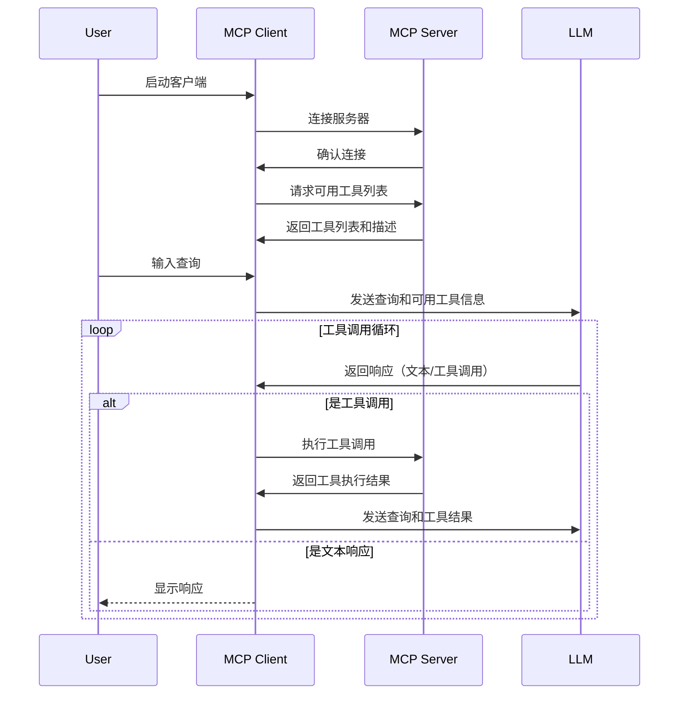

MCP 遵循客户端 - 服务端架构（C/S），其中包括 MCP主机、MCP客户端、MCP服务器、本地资源、远程资源

+ MCP主机：作为 MCP 主要运行程序，例如 Claude Desktop、Cursor、Cline 或AI工具作为用户提供 LLM 交互接口，同时集成 MCP Client 以连接 MCP Server
+ MCP客户端，充当 LLM 和 MCP Server 之间桥梁，嵌入主机程序中，接收 LLM 请求，将请求转发到相应的 MCP Server，最后将 MCP Server结果返回给 LLM
	+ AI变成IDE：Cursor、Cline、Continue等
	+ 聊天工具 Cherry Studio、Claude、Librechat、Chatwise等
MCP 官网：[https://modelcontextprotocol.io/clients](https://modelcontextprotocol.io/clients) 列出了 MCP 的 Clients
更多 Client 参考：[https://www.pulsemcp.com/clients](https://www.pulsemcp.com/clients)

+ MCP服务器：负责从本地数据或远程数据检索i休尼希，是MCP中关键组件，客户端于服务器是1对1关系
	+ 即可以是本地（Stdio）也可以是远程（SSE）
	+ 本质是 nodejs （npx）或 python（uvx） 程序运行

